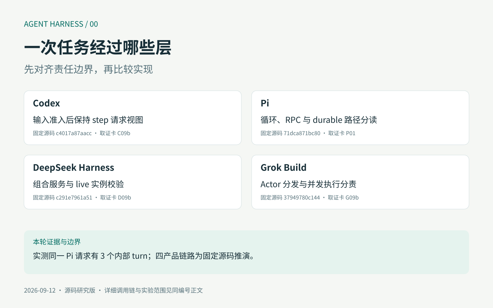
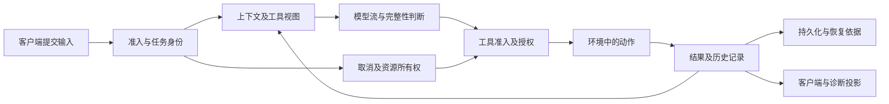
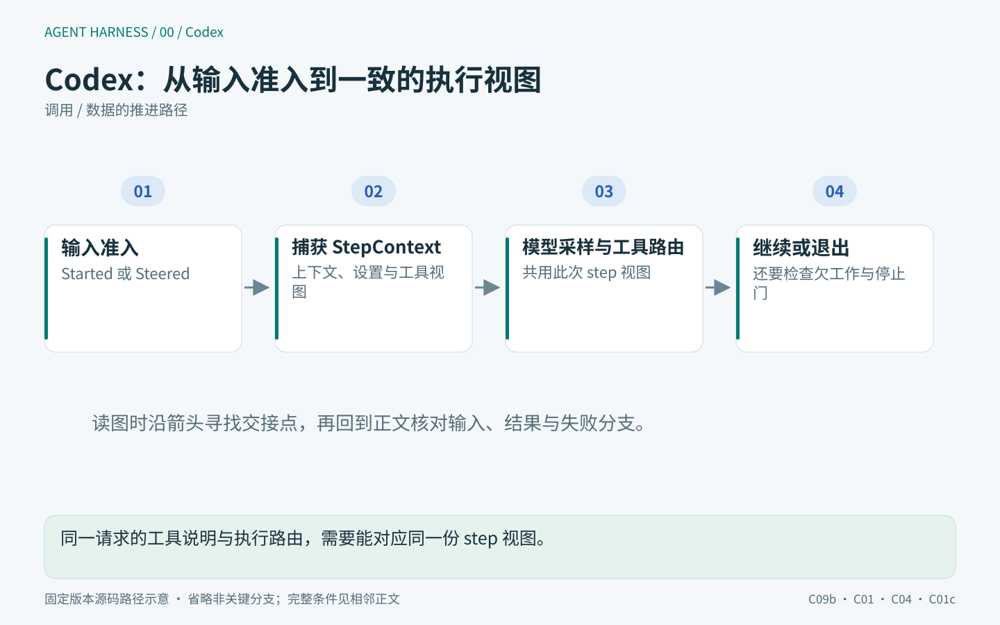
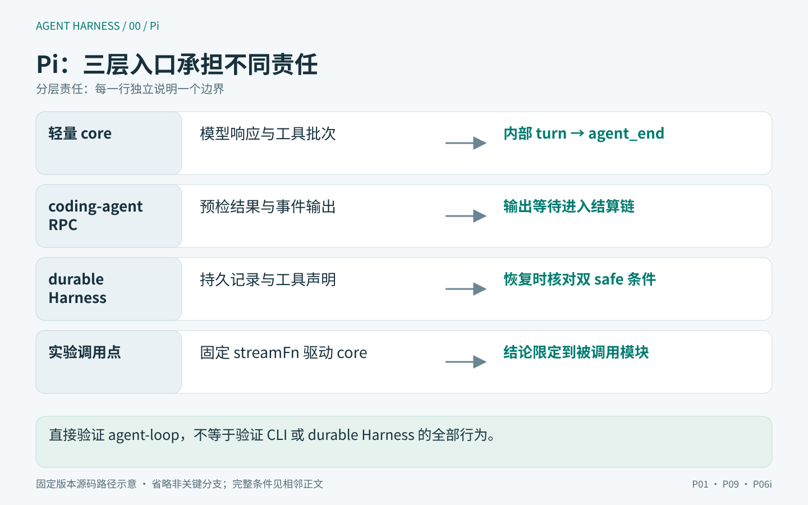
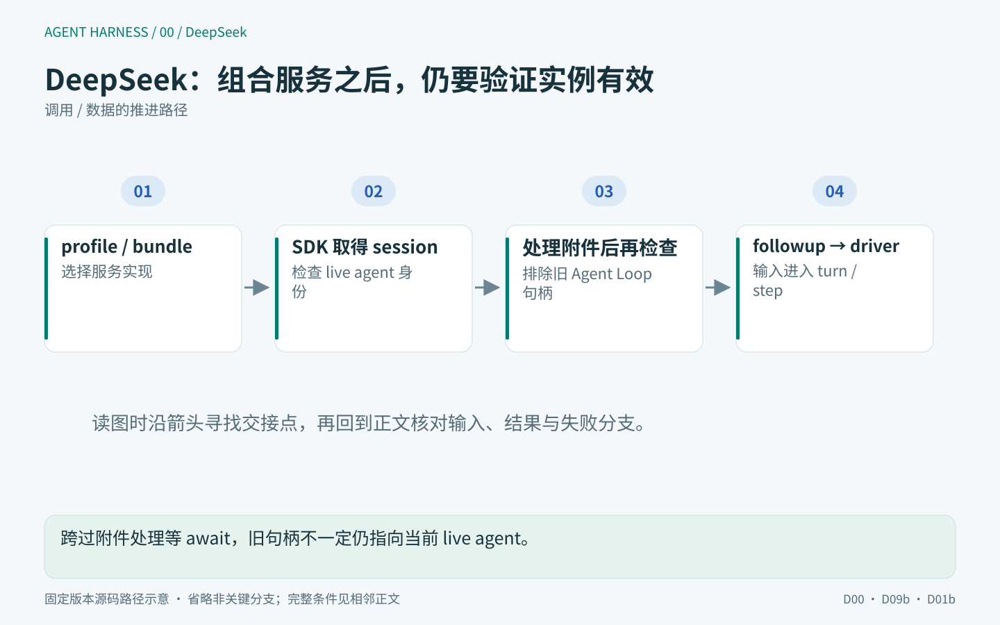
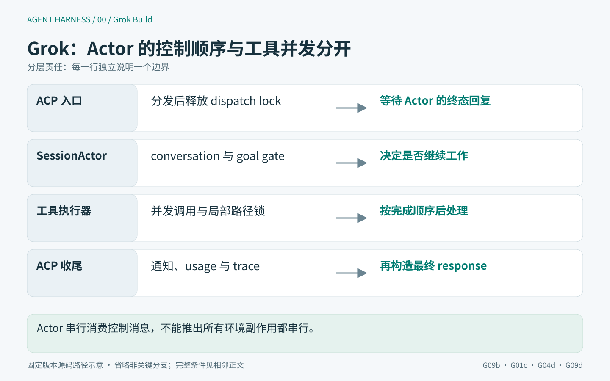
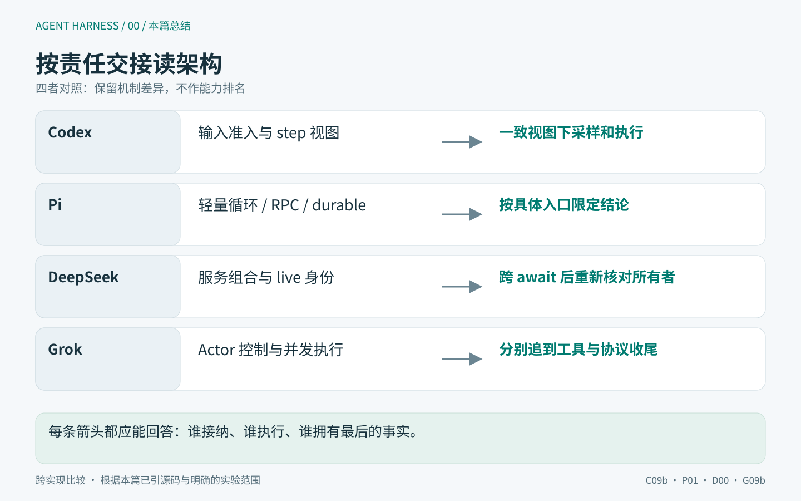

# 00｜一次 Agent 任务经过哪些层？从四种 Harness 看责任边界

用户输入“修复失败测试”，Agent 修改文件、运行测试，最后返回说明。从界面上看，这是一项任务；从实现上看，它可能跨过多次模型调用、多个工具批次和几种不同的“完成”状态。测试进程已经退出，结果可能还没保存；客户端已经断开，任务也可能仍在运行。

本文把 **Harness** 理解为组织模型执行的软件层：它准备上下文，接纳工具调用，协调权限与执行环境，并管理运行状态、结果和收尾。客户端负责提交输入与呈现进度，模型生成下一步意图，工具及环境产生实际副作用。具体仓库如何划分这些职责，需要沿调用链确认。

导读从同一个“修复失败测试”的场景出发，比较 Codex、Pi、DeepSeek Harness 和 Grok Build 的四条实现路径。目标是建立后续阅读的坐标：**一个动作由谁接纳、谁执行、谁保存结果，又由谁确认结束？**

> 研究范围：源码基线固定于 2026-09-12，局部实验记录来自 2026-09-12 至 13 日；本文于 2026-09-14 润色。四条产品链路属于源码推演，局部实验仅验证明确列出的原模块与合成输入，未完成四产品端到端横评。完整提交、归档哈希及 Grok `SOURCE_REV` 见[版本记录](../evidence/versions.json)，运行范围见[实验说明](../evidence/EXPERIMENTS.md)。

## 一、“修复完成”包含哪些不同的事实

假设工具已经改了文件，执行结果刚产生，但还没写入历史，此时进程崩溃。恢复后文件是新的，历史里却只有工具调用。若没有区分历史记录与外部状态，就可能得到两种互相冲突的结论：记录里没有结果，所以重跑；文件已经改变，所以把结果补成成功。前者可能重复副作用，后者可能伪造并未完成的后续操作。

真正要追的是几次交接：模型提出意图，运行时接纳可执行调用，授权机制决定允许范围，环境产生副作用，结果进入运行历史，持久化后端承担恢复承诺，客户端消费相应投影。一个 `done` 标记无法同时表达这些状态。

图中按职责分层，不对应四个仓库中一一匹配的类或模块。箭头也不意味着原子事务。阅读源码时，需要检查每次交接的条件：下游何时可以开始，上游何时可以返回，失败后还有谁必须等待。

## 二、Codex：让模型请求与工具执行使用一致的视图

先从真实客户端入口走。App Server `turn/start` 不直接等模型完成，它构造输入和设置覆盖，调用 core 的 `start_or_steer_turn`。返回 `Started` 或 `Steered` 都可形成成功响应，`NotSubmitted` 则转成错误。这表示 `turn/start` 也可能向已有 turn 追加输入；用户每点一次发送，并不必然创建新的一轮执行。[客户端准入](https://github.com/openai/codex/blob/c4017a87aacc7558002b7cb510025e967c1d765e/codex-rs/app-server/src/request_processors/turn_processor.rs#L595-L714)

<!-- harness-diagram:00-codex -->

*图 00 · Codex：同一请求的工具说明与执行路由，需要能对应同一份 step 视图。*

图示依据：[C09b](https://github.com/openai/codex/blob/c4017a87aacc7558002b7cb510025e967c1d765e/codex-rs/app-server/src/request_processors/turn_processor.rs#L595-L714)、[C01](https://github.com/openai/codex/blob/c4017a87aacc7558002b7cb510025e967c1d765e/codex-rs/core/src/session/turn.rs#L423-L580)、[C04](https://github.com/openai/codex/blob/c4017a87aacc7558002b7cb510025e967c1d765e/codex-rs/core/src/tools/parallel.rs#L42-L250)、[C01c](https://github.com/openai/codex/blob/c4017a87aacc7558002b7cb510025e967c1d765e/codex-rs/core/src/session/turn.rs#L580-L710)。固定版本源码示意；省略的条件与实验边界见本节正文。

<!-- /harness-diagram -->

进入 core 后，`run_turn` 的每次循环还要处理模型调用之外的工作。它处理待接纳输入、Hook、上下文窗口状态和所需服务；依据已准备的 step 视图及新输入情况，复用或捕获 `StepContext`。之后记录变化的环境状态（world state）、构造发给模型的历史，再把同一 `StepContext` 交给采样请求。[step 捕获与采样](https://github.com/openai/codex/blob/c4017a87aacc7558002b7cb510025e967c1d765e/codex-rs/core/src/session/turn.rs#L423-L580)

从这条链可以提炼出一个设计约束：模型看到的工具和上下文，应与实际分派工具时使用的请求视图一致。若工具列表来自时刻 A，执行路由却任意取时刻 B 的注册表，热加载就可能把“模型调用未知工具”的错误伪装成模型问题。因此，固定 step 视图的一个工程收益，是让请求期间的工具说明与执行路由保持一致。这是依据调用关系作出的设计分析。[ToolCallRuntime](https://github.com/openai/codex/blob/c4017a87aacc7558002b7cb510025e967c1d765e/codex-rs/core/src/tools/parallel.rs#L42-L250)

工具调用随后进入路由器、并发准入和执行器。权限检查与执行隔离由这些后续路径处理，不能从 step 快照本身推得。某次执行被 sandbox 拒绝后，orchestrator 还要判断能否升级、是否重审以及第二次 attempt 的范围。这里的 attempt 是同一逻辑调用的环境执行尝试，不是新的用户请求。[重审与再次执行](https://github.com/openai/codex/blob/c4017a87aacc7558002b7cb510025e967c1d765e/codex-rs/core/src/tools/orchestrator.rs#L414-L542)

返回工具结果后，还不能仅因模型没有新工具就宣称 turn 必然结束。后续有输入、窗口以及 Stop Hook 等条件；停止门可以要求继续。因此追一个“为什么它还在运行”的问题，必须读到最终退出分支，而不是停在模型响应的 stop 字段。[停止门](https://github.com/openai/codex/blob/c4017a87aacc7558002b7cb510025e967c1d765e/codex-rs/core/src/session/turn.rs#L580-L710)

这条路径把一致请求视图与有状态执行控制连接得较紧。它让一次工具调用可以关联到明确的 step、turn 和权限环境，代价是研究者需要跨输入准入、采样、工具与退出路径，单读一处 `while` 循环无法覆盖这些责任。

## 三、Pi：分清核心循环、客户端与持久运行时

Pi core 的循环可以通过注入固定响应的 `streamFn` 来观察。进入 `runLoop` 后，内层围绕工具调用和追加输入（steering）继续，外层在内层无工作后轮询后续输入（follow-up）。一次模型响应加相关工具处理会形成一次内部 `turn_end`；外层没有后续消息才会走到 `agent_end`。[嵌套循环](https://github.com/earendil-works/pi/blob/71dca871bc80b6bc97be37f0ca3189399d651fff/packages/agent/src/agent-loop.ts#L156-L277)

<!-- harness-diagram:00-pi -->

*图 00 · Pi：直接验证 agent-loop，不等于验证 CLI 或 durable Harness 的全部行为。*

图示依据：[P01](https://github.com/earendil-works/pi/blob/71dca871bc80b6bc97be37f0ca3189399d651fff/packages/agent/src/agent-loop.ts#L156-L277)、[P09](https://github.com/earendil-works/pi/blob/71dca871bc80b6bc97be37f0ca3189399d651fff/packages/coding-agent/src/modes/rpc/rpc-mode.ts#L350-L430)、[P06i](https://github.com/earendil-works/pi/blob/71dca871bc80b6bc97be37f0ca3189399d651fff/packages/agent/src/harness/runtime/drive/tools.ts#L515-L545)。固定版本源码示意；省略的条件与实验边界见本节正文。

<!-- /harness-diagram -->

本系列的局部实验向原始 core 提供三个确定响应：第一批工具、第二批工具、最终文本。实测得到 3 次内部 turn 结束、1 次 Agent run 结束、2 次合成写入。这个结果证明的是循环边界，不证明真实模型完成了代码修复。[实际结果](../evidence/pi-lab-results.json)

继续往工具层追，就能看见“轻量”没有消除次序问题：参数准备和 `beforeToolCall` 在执行之前；并发批次也有整批准备阶段，之后启动执行，再按所选规则组织结果。某个准备 Hook 阻塞，会影响其他工具何时能开始；某个工具被拒绝，不代表已启动同伴的副作用会回滚。[准备和调用](https://github.com/earendil-works/pi/blob/71dca871bc80b6bc97be37f0ca3189399d651fff/packages/agent/src/agent-loop.ts#L607-L714) [批次调度](https://github.com/earendil-works/pi/blob/71dca871bc80b6bc97be37f0ca3189399d651fff/packages/agent/src/agent-loop.ts#L409-L550)

往上看 coding-agent RPC 又是另一层：prompt 预检成功就可以应答，Agent 事件订阅还会等待 stdout 输出屏障。于是“收到成功响应”“看到 agent_end”“调用已经结算”仍可不同步。这不是 core 名词不清楚，而是产品层给 core 接入了新的等待者。[RPC 接纳](https://github.com/earendil-works/pi/blob/71dca871bc80b6bc97be37f0ca3189399d651fff/packages/coding-agent/src/modes/rpc/rpc-mode.ts#L350-L430) [输出等待](https://github.com/earendil-works/pi/blob/71dca871bc80b6bc97be37f0ca3189399d651fff/packages/coding-agent/src/core/output-guard.ts#L1-L107)

同一个固定 Pi 仓库还包含 durable Harness。这里的 durable 指围绕持久记录组织执行与恢复。它记录工具的计划、效果与结果，恢复时会检查旧记录与当前工具声明的 safe 条件。core 消息循环的实验没有覆盖这条持久恢复路径，也不能因为 core 易于替换 streamFn 就声称整个产品没有恢复层。[durable 恢复条件](https://github.com/earendil-works/pi/blob/71dca871bc80b6bc97be37f0ca3189399d651fff/packages/agent/src/harness/runtime/drive/tools.ts#L515-L545)

Pi 对研究方法的启发是把实验对象精确到路径：我运行了原始 agent-loop，不等于运行了 CLI；运行子 Agent 示例中的函数，也不等于验证了完整插件加载与真实模型。层次清楚，才有办法把小实验推广到它实际支持的结论范围。

## 四、DeepSeek：服务替换以后，谁保证实例仍然有效

DeepSeek Harness 中 `agents`、`agentLoop`、`sessions`、`tools`、`llm` 是插件树中的服务接口。配置组合（profile/bundle）决定装入哪些实现，默认 loop 只是其中一条执行路径。所以问“内核在哪里”，必须同时确定当前讨论的是服务定义、具体实现，还是组合它们的宿主。[架构与组合](https://github.com/deepseek-ai/deepseek-harness/blob/c291e7961a515f6d7af9304e7fd1d257929aef26/docs/architecture.md#L8-L120)

<!-- harness-diagram:00-deepseek -->

*图 00 · DeepSeek：跨过附件处理等 await，旧句柄不一定仍指向当前 live agent。*

图示依据：[D00](https://github.com/deepseek-ai/deepseek-harness/blob/c291e7961a515f6d7af9304e7fd1d257929aef26/docs/architecture.md#L8-L120)、[D09b](https://github.com/deepseek-ai/deepseek-harness/blob/c291e7961a515f6d7af9304e7fd1d257929aef26/packages/sdk/server/src/server.ts#L175-L260)、[D01b](https://github.com/deepseek-ai/deepseek-harness/blob/c291e7961a515f6d7af9304e7fd1d257929aef26/packages/core/agent-loop/src/agent.ts#L125-L250)。固定版本源码示意；省略的条件与实验边界见本节正文。

<!-- /harness-diagram -->

以 SDK 路径为入口，prompt 先取得或创建 session record，在异步附件处理前后检查 agent 仍是注册表里的同一实例，再调用 `followup` 并返回 `messageId`。这个双检查是插件可替换性带来的具体工程要求：旧 record 可能存活，但它引用的 Agent Loop 实例已经被卸载；仅仅拿得到句柄不意味着仍能安全交付。[SDK live 检查](https://github.com/deepseek-ai/deepseek-harness/blob/c291e7961a515f6d7af9304e7fd1d257929aef26/packages/sdk/server/src/server.ts#L175-L260)

默认 agent loop 随后把 inbox 输入交给 driver 的 turn/step 路径。准备阶段组装 system prompt 与 tools；step 内准备模型调用、投影系统提示变化，在第一次 attempt 记录该 step 的用户输入，然后构造请求并消费流。请求 attempt、step 与 turn 是分层身份，重试不能随意把用户消息重复追加成新输入。[输入与 driver 所有权](https://github.com/deepseek-ai/deepseek-harness/blob/c291e7961a515f6d7af9304e7fd1d257929aef26/packages/core/agent-loop/src/agent.ts#L125-L250) [实际 step](https://github.com/deepseek-ai/deepseek-harness/blob/c291e7961a515f6d7af9304e7fd1d257929aef26/packages/core/agent-loop/src/agent.ts#L352-L412)

模型流还可以通过配套的严格校验模块检查完整性。组装器能够给出默认 `stop`，并不说明启用严格校验后的组合也会接受不完整流；具体行为要看装配了哪些模块。工具执行则进入有界滚动池：空出的槽位可以启动后续工具，结果提交仍按原调用次序前进，exclusive 等条件还会改变准入。[流校验](https://github.com/deepseek-ai/deepseek-harness/blob/c291e7961a515f6d7af9304e7fd1d257929aef26/packages/llm/llm/src/invariant.ts#L1-L112) [工具池](https://github.com/deepseek-ai/deepseek-harness/blob/c291e7961a515f6d7af9304e7fd1d257929aef26/packages/core/agent-loop/src/tool-calls.ts#L130-L290)

插件边界没有让生命周期自动正确。Cordis 的 effect、setup 和 dispose 仍需要规定等待关系；服务更换时依赖者可能需要重启。这个架构的收益是宿主可以替换 policy、存储或模型实现，代价是必须同时检查接口契约和装配后的生命周期，不能拿“有某个插件包”代替默认部署行为。[卸载和等待](https://github.com/deepseek-ai/deepseek-harness/blob/c291e7961a515f6d7af9304e7fd1d257929aef26/vendor/cordis/src/fiber.ts#L675-L709)

与 Codex 的请求快照相比，两者都在解决“异步操作期间世界改变”的问题，只是主要工具不同：一个强调执行视图一致性，一个强调服务实例与生命周期归属。它们并不互斥，不能用静态/动态两个标签概括优劣。

## 五、Grok Build：会话控制的顺序与工具执行的并发

Grok Build 的 ACP prompt 先把带 `respond_to` 的消息交给 `SessionActor`：普通路径进入用户输入投递流程（human delivery），`sendNow` 走直接命令。分发后释放 dispatch lock，再等待 Actor 的终态回复。锁保护分发阶段，而不是持有到整轮模型执行结束。[分发与等待](https://github.com/xai-org/grok-build/blob/37949780c144e37df692e3d669051a21fec24f20/crates/codegen/xai-grok-shell/src/agent/mvp_agent/acp_agent.rs#L1325-L1469)

<!-- harness-diagram:00-grok -->

*图 00 · Grok Build：Actor 串行消费控制消息，不能推出所有环境副作用都串行。*

图示依据：[G09b](https://github.com/xai-org/grok-build/blob/37949780c144e37df692e3d669051a21fec24f20/crates/codegen/xai-grok-shell/src/agent/mvp_agent/acp_agent.rs#L1325-L1469)、[G01c](https://github.com/xai-org/grok-build/blob/37949780c144e37df692e3d669051a21fec24f20/crates/codegen/xai-grok-shell/src/session/acp_session_impl/turn.rs#L1250-L1400)、[G04d](https://github.com/xai-org/grok-build/blob/37949780c144e37df692e3d669051a21fec24f20/crates/codegen/xai-grok-shell/src/session/acp_session_impl/tool_calls.rs#L928-L1064)、[G09d](https://github.com/xai-org/grok-build/blob/37949780c144e37df692e3d669051a21fec24f20/crates/codegen/xai-grok-shell/src/agent/mvp_agent/acp_agent.rs#L1620-L1722)。固定版本源码示意；省略的条件与实验边界见本节正文。

<!-- /harness-diagram -->

Actor 的 turn 路径继续组织 conversation、sampler、工具与外层 goal/stop gate。模型适配器决定流式结果怎样成为可用输出，工具执行器则可以通过 `FuturesUnordered` 并发执行并按完成序后处理。Actor 作为控制入口，没有给所有工具副作用提供天然串行保证。[外层继续条件](https://github.com/xai-org/grok-build/blob/37949780c144e37df692e3d669051a21fec24f20/crates/codegen/xai-grok-shell/src/session/acp_session_impl/turn.rs#L1250-L1400) [并发完成处理](https://github.com/xai-org/grok-build/blob/37949780c144e37df692e3d669051a21fec24f20/crates/codegen/xai-grok-shell/src/session/acp_session_impl/tool_calls.rs#L928-L1064)

例如模型同时提出编辑与测试，测试能否看到编辑结果不能从“都属于同一个 Actor”推出。还要看这两个工具怎样进入批次、哪些锁覆盖哪些路径、是否存在明确依赖。路径互斥只限制竞争访问，不自动建立“先编辑、再测试”的业务顺序。这一问题将在 04《工具执行与并发》中展开。

workspace 管理权限与工作区状态，但权限模式也不是一层简单开关：规则拒绝、授权来源、classifier 结果和已有 grant 有各自优先级。checkpoint 的恢复域又不能代替远端副作用事务。这里必须跨 crate 追踪，因为会话控制、模型协议和环境操作分别拥有不同事实。[权限优先级](https://github.com/xai-org/grok-build/blob/37949780c144e37df692e3d669051a21fec24f20/crates/codegen/xai-grok-workspace/src/permission/manager/mod.rs#L1651-L1760) 恢复范围将在 06《恢复与外部副作用》中展开。

Actor 回复后，ACP 入口还会发完成通知、整理 usage 和 trace，按策略等待或后台执行部分收尾。因此长请求的响应耗时包含哪些阶段，还要继续追到协议层返回；不能把 Actor 内的终态计时直接当作客户端总耗时。[终态后收尾](https://github.com/xai-org/grok-build/blob/37949780c144e37df692e3d669051a21fec24f20/crates/codegen/xai-grok-shell/src/agent/mvp_agent/acp_agent.rs#L1473-L1575) [最终响应](https://github.com/xai-org/grok-build/blob/37949780c144e37df692e3d669051a21fec24f20/crates/codegen/xai-grok-shell/src/agent/mvp_agent/acp_agent.rs#L1620-L1722)

这条路径提醒我们：架构图中的模块边界，还需要配上实际的等待关系。`SessionActor` 可以顺序处理控制消息，工具仍可并发产生副作用。理解行为，需要标出在哪里启动并发、在哪里等待结果，以及谁负责最后的收尾。

## 六、同样支持工具并发，为什么等待行为不同

把两项独立工具 A、B 放在同一响应里，让 A 的准备慢、B 的执行快，四套路径不会因为都支持“并发工具”就表现相同。Pi 整批准备可能让 B 等 A 准备结束；DeepSeek 滚动池会按槽位补位，但提交仍需等待前序结果；Codex 还要区分环境 readiness、准入锁和有序收集；Grok 的后置处理与完成顺序联系更直接。04《工具执行与并发》将逐项展开这些分支与实验。这里比较的是固定源码中的调度机制，没有测量四产品的端到端延迟。

| 看起来相同的词 | 必须补问的具体问题 | 为什么影响结论 |
|---|---|---|
| 一轮结束 | 模型调用、内部 turn、用户工作还是资源结算？ | 决定停止条件和统计分母 |
| 工具并发 | 准备、执行、后置处理还是提交并发？ | 决定阻塞与副作用顺序 |
| 已批准 | 哪些最终参数、哪个 attempt、哪种权限范围？ | 决定允许执行的真实动作 |
| 已保存 | 内存可见、后端接受还是稳定落盘？ | 决定崩溃后能推断什么 |
| 已取消 | 停止等待、停止接纳还是资源退出？ | 决定是否还会产生副作用 |
| 已完成 | 执行终态、记录终态还是客户端已消费？ | 决定恢复与界面行为 |

这张表也是阅读顺序：01 先对齐循环；02、03 解释模型与上下文；04、05 追到动作和权限；06 处理失败后的世界；07、08 讨论动态扩展与委派；09、10 解释客户端与证据；11 再提出有代价说明的设计选择。

## 七、哪些结论来自源码，哪些经过了实验

原模块实验可以精确控制真实模型难以重复触发的时序。例如 Pi 的停止检查在 follow-up 轮询之前，实测停止时后者调用次数为 0；DeepSeek 的传输层反例则显示：客户端因超时拒绝请求后，测试中等待释放的服务端处理函数仍可继续，并产生计数器副作用。它们提供可证伪的机制结论，无法回答模型在真实仓库中解决任务的概率。[循环反例](../evidence/deep-dive-results.json) [客户端反例](../evidence/clients-results.json)

本系列区分三类证据：固定源码直接支持的行为；注明替身与控制点的运行观察；由前两者推导的设计判断。未构建运行的 Codex/Grok 路径只报告源码分析；未运行的产品网络、OS 隔离、崩溃恢复和真实模型评测保留为未知。通过数记录检查数量，不作为四项目排名。

回到最初的“修复失败测试”：模型说完成了，只是这条链上的一个信号。我们仍需确认工具执行到哪一步、结果是否保存、资源是否退出，以及客户端看到了什么。后续各篇都沿这条线追问：状态由谁持有，什么条件允许继续，失败之后由谁收尾。这样读源码，才能解释一次任务为什么继续、为什么等待，又为什么能够结束。

<!-- harness-diagram:00-summary -->

*图 00 · 本篇总结：每条箭头都应能回答：谁接纳、谁执行、谁拥有最后的事实。*

图示依据：[C09b](https://github.com/openai/codex/blob/c4017a87aacc7558002b7cb510025e967c1d765e/codex-rs/app-server/src/request_processors/turn_processor.rs#L595-L714)、[P01](https://github.com/earendil-works/pi/blob/71dca871bc80b6bc97be37f0ca3189399d651fff/packages/agent/src/agent-loop.ts#L156-L277)、[D00](https://github.com/deepseek-ai/deepseek-harness/blob/c291e7961a515f6d7af9304e7fd1d257929aef26/docs/architecture.md#L8-L120)、[G09b](https://github.com/xai-org/grok-build/blob/37949780c144e37df692e3d669051a21fec24f20/crates/codegen/xai-grok-shell/src/agent/mvp_agent/acp_agent.rs#L1325-L1469)。跨实现比较 · 根据本篇已引源码与明确的实验范围。

<!-- /harness-diagram -->
