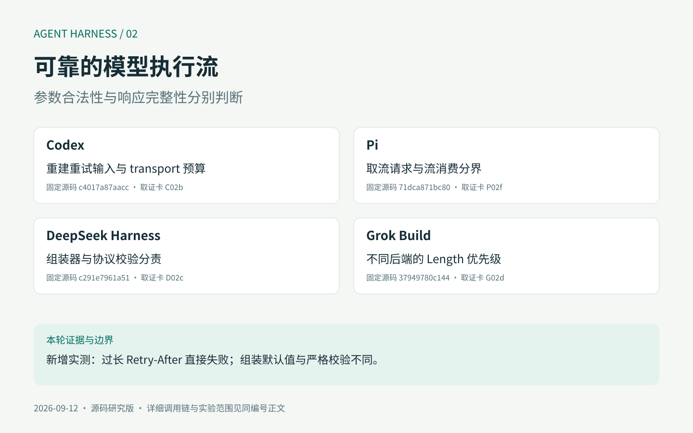
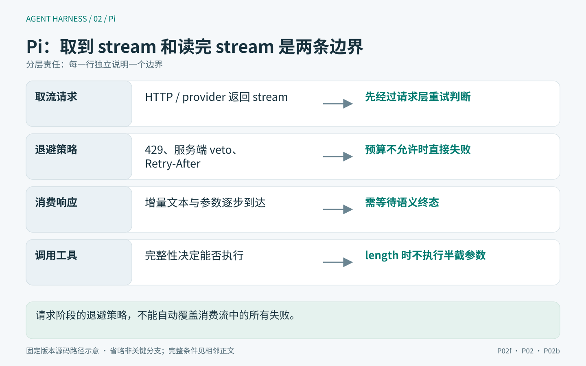
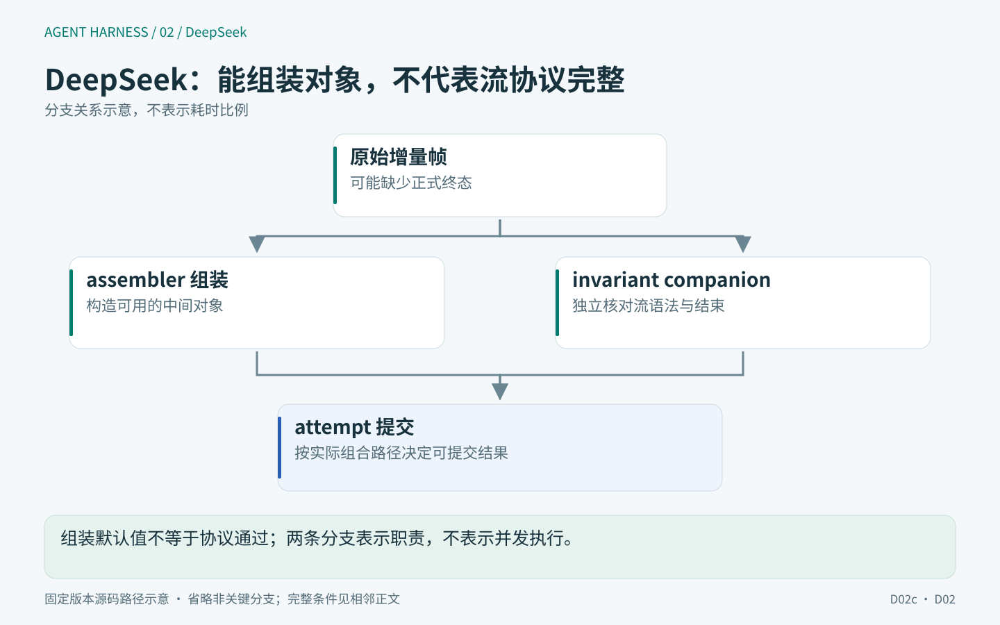
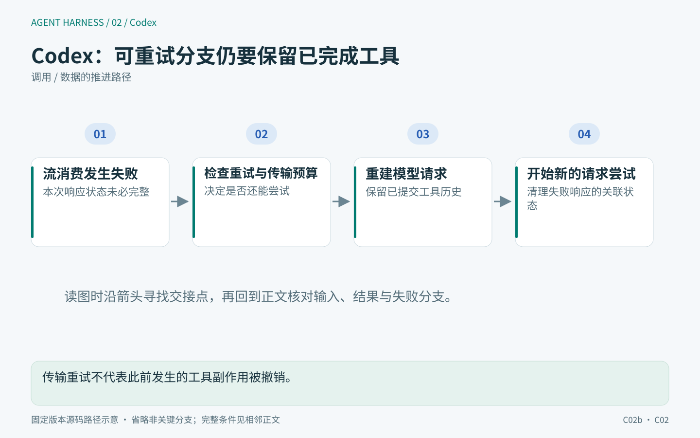
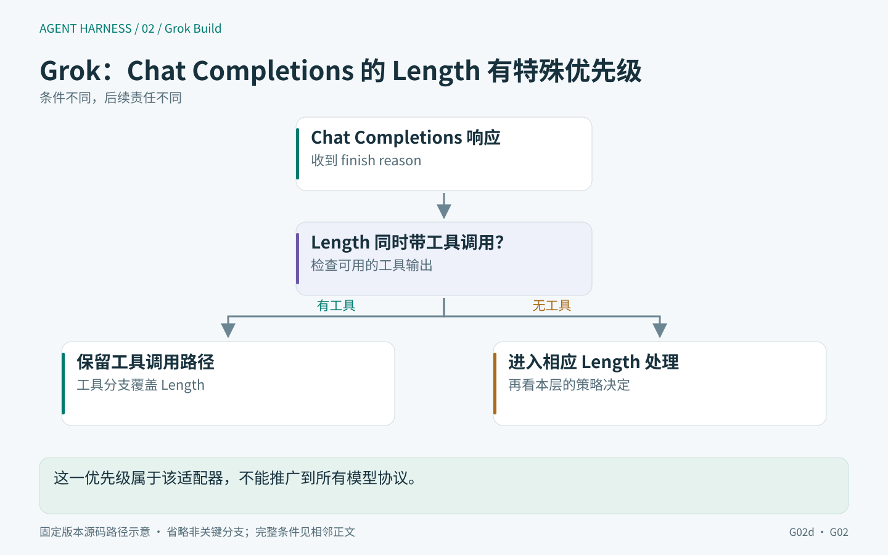
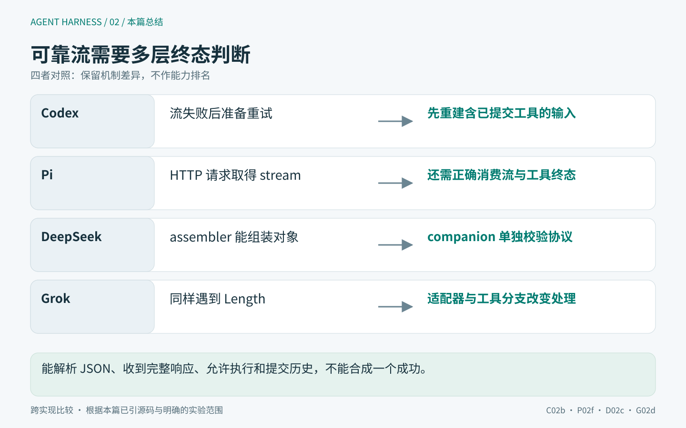

# 02｜模型流何时可以执行工具？四种 Harness 的终态与重试



模型输出工具参数 `{"path":"report.md","content":"结论……"}`，随后连接断开。界面已经显示一个工具卡片，参数对象也通过了 JSON 校验。此时能否写文件？如果自动重连，应该重新发出原请求，还是把已产生的内容和工具结果带回去？

这两个问题连在一起：**允许执行工具的时刻，决定了后续重试是否可能越过副作用边界。** 把四个 SDK 包成 `stream(messages)`，只能统一调用形式；决定可靠性的工作发生在增量组装、终止归类、记录提交和下一次请求构造之间。

本文锁定[四份源码提交](../evidence/versions.json)。重点比较“相同故障在各层怎样被解释”，而不是比较供应商稳定性。2026-09-13 的局部实验调用 Pi 原始请求重试函数与 DeepSeek 组装/校验代码，输入为合成数据；未访问真实模型接口。

> 版本与证据：源码基线固定于 2026-09-12，实验记录来自 2026-09-12 至 13 日；本文于 2026-09-14 润色，未重新执行实验。源码事实、局部实验观察与设计判断分别表述，不代表四产品端到端验收。详见[本篇实验说明](../evidence/EXPERIMENTS.md)。


## 一条流里存在四种不同的完成

可以把工具相关状态分成下面四层：

```text
参数增量可展示
  → 一个输出 block 已闭合
  → 整个响应得到终止原因
  → 运行时允许执行并把结果纳入下一次请求
```

第一层允许尽力解析，第二层应有块身份和权威终值，第三层区分正常完成、截断、取消与失败，第四层还需要运行策略和工具校验。一个 `done` 字段无法同时表达这些完成条件。

尤其是字符串参数，Schema 无法证明其内容完整。`content` 从一万字截成一千字，仍可能是合法字符串。相反，一个响应因文本部分达到上限而结束，也不必然意味着此前所有工具块都不完整。实现必须在保守拒绝和利用已完成工作之间选择，并保留作出选择所依赖的事实。

下面带着三个问题读源码：看到工具块是否就能执行；输入流结束（EOF）是否等于成功；“重试 N 次”是否约束了整个用户请求。四套实现对这些问题的答案都不能只在一个函数里找到。

## Pi：HTTP 请求取得流，与消费流，是两个失败边界

### 从 Responses 适配器区分请求与流消费

<!-- harness-diagram:02-pi -->



*图 02 · Pi：请求阶段的退避策略，不能自动覆盖消费流中的所有失败。*

图示依据：[P02f](https://github.com/earendil-works/pi/blob/71dca871bc80b6bc97be37f0ca3189399d651fff/packages/ai/src/utils/provider-retry.ts#L1-L125)、[P02](https://github.com/earendil-works/pi/blob/71dca871bc80b6bc97be37f0ca3189399d651fff/packages/agent/src/agent-loop.ts#L208-L245)、[P02b](https://github.com/earendil-works/pi/blob/71dca871bc80b6bc97be37f0ca3189399d651fff/packages/ai/src/utils/json-parse.ts#L108-L124)。固定版本源码示意；省略的条件与实验边界见本节正文。

<!-- /harness-diagram -->

在 `api/openai-responses.ts` 中，SDK 调用设置 `maxRetries: 0`，外层用 `retryProviderRequest` 包装 `client.responses.create(...).withResponse()`。拿到响应以后才发 start，再进入 `processResponsesStream`。[适配器入口](https://github.com/earendil-works/pi/blob/71dca871bc80b6bc97be37f0ca3189399d651fff/packages/ai/src/api/openai-responses.ts#L122-L218)

所以这里的 provider request retry 包住的是**取得 SDK 响应和流对象**的调用，后面的异步流消费不在这个 wrapper 内。若已经收到若干增量后 iterator 抛错，外层 catch 会将它归为错误/取消响应；不能因为文件顶部导入了 retry helper，就断言该函数会透明重放整段已消费流。

SDK 自带重试被关掉也有明确的实现原因：Pi 的 helper 提供可被 AbortSignal 中断的退避等待。否则请求已经取消，SDK 内部睡眠仍可能继续占用生命周期。这个理由来自代码注释和调用位置，不是对 SDK 作者动机的猜测。[请求重试实现](https://github.com/earendil-works/pi/blob/71dca871bc80b6bc97be37f0ca3189399d651fff/packages/ai/src/utils/provider-retry.ts#L1-L125)

### 超出 Retry-After 上限，是失败，不是缩短等待

helper 先检查 `x-should-retry`，显式 false 可以覆盖 429/5xx 这类默认可重试状态；再处理 `retry-after-ms`、`retry-after`，否则使用指数退避加抖动。

关键分支在 `validateServerRetryDelayMs`：服务器要求等待超过配置上限时，代码抛错，不会把 61 秒缩短为 60 秒后继续请求。默认上限是 60 秒，`maxRetryDelayMs` 为 0 才禁用此上限。默认 `maxRetries` 又是 0；是否启用重试要看实际调用参数。[完整判断](https://github.com/earendil-works/pi/blob/71dca871bc80b6bc97be37f0ca3189399d651fff/packages/ai/src/utils/provider-retry.ts#L1-L125)

这会改变产品体验：等待过长时立即向用户暴露原因，避免悄悄违背服务端要求或无限挂起。新增三个实验分别确认：429 配 0 ms Retry-After 可在显式预算下重试成功；服务端明确禁止重试后只请求一次；61 秒等待要求超过默认上限时立即失败，没有缩短等待后继续重试。第四个实验确认 10 秒退避可被取消，且不发出第二次请求。[运行结果](../evidence/protocol-context-results.json)

### Responses 的终态归一化保留原因，而非只保留 incomplete

`processResponsesStream` 分别处理参数 delta、arguments.done、output_item.done 和 response 终态。终态函数把 provider status 与 incomplete reason 保存为 `rawStopReason`，然后归一化为 core 的 stop reason。`incomplete.max_output_tokens` 映射为 length；其它 incomplete 原因进入 error，不能与输出预算耗尽混为一谈。[终态归一化](https://github.com/earendil-works/pi/blob/71dca871bc80b6bc97be37f0ca3189399d651fff/packages/ai/src/api/openai-responses-shared.ts#L551-L596)、[事件分支](https://github.com/earendil-works/pi/blob/71dca871bc80b6bc97be37f0ca3189399d651fff/packages/ai/src/api/openai-responses-shared.ts#L650-L790)

在 iterator 自然结束后，函数还检查 `sawTerminalResponseEvent`；没有终态事件就抛出明确错误。外层输出初始为 pending，也保留未正常结算的检查。这使“网络连接关闭”和“模型成功完成”保持不同语义。

`parseStreamingJson` 能宽容地恢复部分 JSON，但这一结果本身不能证明工具已经具备执行资格。core 的 `runLoop` 看到 length 时，不执行任何这条消息里的工具，而是逐项产生截断错误结果；看到 error/aborted 时，则直接收束 turn/run。[工具执行资格](https://github.com/earendil-works/pi/blob/71dca871bc80b6bc97be37f0ca3189399d651fff/packages/agent/src/agent-loop.ts#L208-L245)

这个策略牺牲了部分可挽救工作：同一响应里即使 A 的参数已完整、B 的参数被截断，length 分支仍拒绝整批。但它不要求 core 理解每个 provider 的“工具块是否可视为完成”保证，把风险边界压在一个容易解释的响应级条件上。

## DeepSeek：组装器、协议检查、attempt 提交承担不同责任

### 组装器与协议校验器分别判断什么

<!-- harness-diagram:02-deepseek -->



*图 02 · DeepSeek：组装默认值不等于协议通过；两条分支表示职责，不表示并发执行。*

图示依据：[D02c](https://github.com/deepseek-ai/deepseek-harness/blob/c291e7961a515f6d7af9304e7fd1d257929aef26/packages/llm/llm/src/invariant.ts#L1-L112)、[D02](https://github.com/deepseek-ai/deepseek-harness/blob/c291e7961a515f6d7af9304e7fd1d257929aef26/packages/core/agent-loop/src/agent.ts#L352-L566)。固定版本源码示意；省略的条件与实验边界见本节正文。

<!-- /harness-diagram -->

`BlockAssembler` 支持只有 delta、没有完整 start/end 包装的输入；首次 block-end 成为该块权威内容，后来的重复 close 或尾随 delta 不再改写它。其 `finish` getter 在缺少 finish chunk 时默认返回 stop。[组装器](https://github.com/deepseek-ai/deepseek-harness/blob/c291e7961a515f6d7af9304e7fd1d257929aef26/packages/llm/llm/src/assembler.ts#L38-L199)

只读这里，很容易得出“EOF 被当成成功”的全产品结论。但仓库还有独立的配套校验模块 `llm-invariant`：它在 `llm/stream` 外包装校验，检查块索引、delta 对应的开放块类型、重复 usage、finish 后新增事件，以及流结束时必须存在 finish。[协议校验插件](https://github.com/deepseek-ai/deepseek-harness/blob/c291e7961a515f6d7af9304e7fd1d257929aef26/packages/llm/llm/src/invariant.ts#L1-L112)

本轮用同一类缺少 finish 的输入做了对照：原始 assembler 的 getter 返回 stop；通过原始 companion 安装的校验 wrapper 则抛出缺少终态的错误。实验使用测试上下文注册 wrapper，不证明所有产品 profile 都启用了该 companion。

这正是插件型架构分析需要保留的限定：**能在仓库找到校验器，不等于每个部署都执行校验；能在基础组装器找到宽容分支，也不等于最终请求必然被接受。** 正确的审查单位应包含实际插件组合，而不只是某个类。

### 截断会同时改变消息与 replay metadata

`BlockAssembler.assembled()` 在 max-tokens 时删除 tool-call blocks，并用同一 keep/drop 掩码裁剪 per-block replay envelope。如果 replay blocks 数量与实际块数量不一致，直接丢弃 replay envelope，避免错误对齐。[统一裁剪](https://github.com/deepseek-ai/deepseek-harness/blob/c291e7961a515f6d7af9304e7fd1d257929aef26/packages/llm/llm/src/assembler.ts#L38-L199)

这比只过滤可见消息多一层一致性要求。否则界面看起来已经去掉工具，provider 私有重放信息却仍指向原位置；下一次路由恢复时，消息和重放元数据可能描述两份不同响应。

取消走 `interruptedBlocks()`，只保留非空文本与 reasoning，不保留工具调用；因为此时尚未进入 dispatch，若保留工具意图，后续还需说明它为何没有对应的执行结果。新增测试确认 max-tokens 的正文/metadata 同步裁剪、首次 close 不被迟到数据覆盖，以及取消前缀不携带工具。[实验结果](../evidence/protocol-context-results.json)

### attempt 记录与 assistant message 为什么要分开

在 Agent step 内，每次尝试创建 `AssistantStreamAttempt`，把相同 chunk 送入紧凑日志 accumulator、canonical assembler 和临时 frame。成功时写 assistant/message；已开始的失败尝试可以写 assistant/attempt，避免把每次失败都作为可执行的成功回答纳入上下文。[attempt 结算](https://github.com/deepseek-ai/deepseek-harness/blob/c291e7961a515f6d7af9304e7fd1d257929aef26/packages/core/agent-loop/src/assistant-stream.ts#L46-L140)、[step 分支](https://github.com/deepseek-ai/deepseek-harness/blob/c291e7961a515f6d7af9304e7fd1d257929aef26/packages/core/agent-loop/src/agent.ts#L352-L493)

`settle` 的次序是先调用 append，拿到 seq 后才发 committed end frame。若 append 抛错，则发 abandoned，而不是给客户端一个指向不存在记录的成功 seq。这能让临时展示与会话记录对上身份，但这里的 committed 指 append 契约，不能自动升级为磁盘 flush 成功。

还有一个细节：流正常提供 error/aborted finish 时，step 会写 attempt 并调用 `agent/request-error` waterfall，只有它返回 retry 才继续请求循环；若 iterator 直接抛异常，则先处理中断/失败的 durable settlement，再向外抛出。两种错误表现不应该在分析中统称“自动重试”。

### 重试前重新准备路由，却不能重复接纳用户输入

step 内部循环每次调用 `prepareRequest`，经过请求 waterfall 和 `llm.prepareCall` 绑定实际适配器；但用户消息仅在 firstAttempt 时 append。随后 buildRequest 从 admitted surface 取消息，深冻结消息与 header，保留同一个活动 signal。[路由与请求冻结](https://github.com/deepseek-ai/deepseek-harness/blob/c291e7961a515f6d7af9304e7fd1d257929aef26/packages/core/agent-loop/src/agent.ts#L495-L619)

它试图避免两个问题：候选 provider 与实际 adapter 不一致导致历史装配错误；重试同一步时，把同一份用户输入重复写进会话。冻结的是这次请求的数据视图，取消信号仍是活动控制对象，不通过深克隆变成失去取消能力的数据副本。

## Codex：流重试可能发生在部分工具已经完成之后

### 重试循环没有盲目重发同一份原始输入

<!-- harness-diagram:02-codex -->



*图 02 · Codex：传输重试不代表此前发生的工具副作用被撤销。*

图示依据：[C02b](https://github.com/openai/codex/blob/c4017a87aacc7558002b7cb510025e967c1d765e/codex-rs/core/src/session/turn.rs#L1530-L1651)、[C02](https://github.com/openai/codex/blob/c4017a87aacc7558002b7cb510025e967c1d765e/codex-rs/core/src/responses_retry.rs#L1-L160)。固定版本源码示意；省略的条件与实验边界见本节正文。

<!-- /harness-diagram -->

`run_sampling_request` 在循环外创建 `ToolCallRuntime` 与 retry state。第一次取 initial_input，后续重试改为从当前会话历史投影 prompt，并附带已执行工具调用的相关记录；每次还清除此前 ResponseId，防止后续工具归因到上一响应。[完整请求循环](https://github.com/openai/codex/blob/c4017a87aacc7558002b7cb510025e967c1d765e/codex-rs/core/src/session/turn.rs#L1530-L1651)

结合第 04 篇可知，Codex 会在流中的输出项完成后建立工具 future，工具可能早于整个采样流结束完成。因此，一个可重试 stream error 不必然意味着“什么都没发生”。重新取历史和清理响应身份，是这种执行时序下需要面对的责任。

这条路径仍不足以保证外部动作恰好执行一次（exactly-once）。相同外部动作是否重复、已执行记录何时写入、不同 provider 如何表示续接，需要继续追工具与外部系统的幂等边界。本文能够确认的是重试输入不是静态原请求的无条件复制。

### 三条退避路径，为什么不能合成一个次数

在进入共享重试决策前，caller 已处理 ContextWindowExceeded、UsageLimitReached 等专门错误，并拒绝 `!err.is_retryable()` 的情况。重试状态随后区分普通 retries、connection_retries 和连接退避间隔。[请求资格检查](https://github.com/openai/codex/blob/c4017a87aacc7558002b7cb510025e967c1d765e/codex-rs/core/src/session/turn.rs#L1530-L1651)、[共享决策](https://github.com/openai/codex/blob/c4017a87aacc7558002b7cb510025e967c1d765e/codex-rs/core/src/responses_retry.rs#L1-L160)

无界连接重试只在一组明确条件同时满足时生效：功能开关开启、Sampling 请求、ConnectionFailed、非 internal session、非 Amazon Bedrock。它按 5、10、20、40、60 秒增长，之后保持 60 秒，并不消耗普通 retries 分支的计数。

普通重试次数耗尽时，如果 client_session 能切换 fallback transport，代码将普通 retries 重置为 0 并继续。否则，在预算尚存时使用服务端建议延迟或本地 backoff；彻底耗尽后把包含 turn_id 的 retry advice 写入扩展状态再返回错误。

所以“max_retries=2”最多描述一个普通重试预算阶段，不能不加条件地解释成“用户请求最多三次网络尝试”。transport 切换、连接恢复、外层压缩或任务继续都可能具有不同重试身份。监控应记录原因与层次，不能只累加一个 retry_count。

## Grok：同一个产品，不同模型协议的 Length 优先级也不相同

### collector 的 Completed 只表示流已有终态结果

<!-- harness-diagram:02-grok -->



*图 02 · Grok Build：这一优先级属于该适配器，不能推广到所有模型协议。*

图示依据：[G02d](https://github.com/xai-org/grok-build/blob/37949780c144e37df692e3d669051a21fec24f20/crates/codegen/xai-grok-sampler/src/stream/chat_completions.rs#L232-L259)、[G02](https://github.com/xai-org/grok-build/blob/37949780c144e37df692e3d669051a21fec24f20/crates/codegen/xai-grok-shell/src/session/acp_session_impl/sampler_turn.rs#L1-L165)。固定版本源码示意；省略的条件与实验边界见本节正文。

<!-- /harness-diagram -->

`collect_response` 用于不需要流式 UI 的调用方，消费 intermediate events，遇 Completed 返回 response，Failed 返回错误，EOF 没有二者则显式报错。[buffered collector](https://github.com/xai-org/grok-build/blob/37949780c144e37df692e3d669051a21fec24f20/crates/codegen/xai-grok-sampler/src/stream/collect.rs#L1-L53)

但 Completed 里的 stop_reason 仍可能是 Length。也就是说，事件流已完整表达一次“输出被截断”的结果，并不意味着结果可以当作普通成功答案使用。是否拒绝或保留可用部分（salvage），由后续 `LengthPolicy` 判断。

### 哪些截断结果仍被允许进入执行

`LengthPolicy` 有 Fail、CompleteToolCalls、CompletePartial。对保留 Length 的响应，默认 CompleteToolCalls 要求存在工具，并且所有参数要么为空，要么能被 JSON parser 完整消费；纯文本截断仍失败。CompletePartial 额外允许非空部分文本。[准入条件](https://github.com/xai-org/grok-build/blob/37949780c144e37df692e3d669051a21fec24f20/crates/codegen/xai-grok-sampling-types/src/conversation.rs#L513-L575)

空参数被当成零参数调用惯例，并不被视为截断的充分证据。源码注释承认“在第一个参数 delta 之前截断”也会收集为空；后续工具校验仍需承担职责。这是明确的分层取舍，不是 JSON parser 证明了模型原意完整。

更需要注意的是协议前置归一化：Chat Completions 流层只要存在 tool_calls，就把 stop reason 改为 ToolCalls，即使原 finish reason 是 Length，同时记录警告。该响应后续不再命中 LengthPolicy 的 Length 分支。[Chat Completions 优先级](https://github.com/xai-org/grok-build/blob/37949780c144e37df692e3d669051a21fec24f20/crates/codegen/xai-grok-sampler/src/stream/chat_completions.rs#L232-L259)

所以不能把一个简单判断统一套到所有 Grok 后端：

| 路径 | 工具与 Length 同时出现时的事实 |
|---|---|
| Pi core 收到 length | 整条消息的工具批次转为错误结果，不执行 |
| DeepSeek assembler 收到 max-tokens | 删除工具块，并同步裁剪 replay metadata |
| Grok 保留 Length 的响应 | 由 LengthPolicy 判断参数及内容能否挽救 |
| Grok Chat Completions 转换路径 | 工具可将 Length 改为 ToolCalls，后续执行仍需工具参数校验 |

这张表不是安全排名。它说明比较必须保留原始 stop reason、转换后类别与具体 backend。对于语法可解析但语义已截短的字符串参数，单独依赖 Schema 或 JSON 完整性都不足以恢复生成意图。应保留 provider 原始终止事实，方便执行层采用更严格策略。

### shell 还对连续 salvage 和恢复过程分别计数

shell 对“Length 且有工具”的连续 salvage 设置 5 次上限，首次加入提醒，超过上限失败；非此类 sample 会重置 streak。另一个 transient retry 状态则包含每采样 step 3 次、每 prompt 累积 10 次、每次恢复 episode 10 分钟的限制。[salvage 与预算类型](https://github.com/xai-org/grok-build/blob/37949780c144e37df692e3d669051a21fec24f20/crates/codegen/xai-grok-shell/src/session/acp_session_impl/sampler_turn.rs#L1-L165)、[shell 消费处](https://github.com/xai-org/grok-build/blob/37949780c144e37df692e3d669051a21fec24f20/crates/codegen/xai-grok-shell/src/session/acp_session_impl/turn.rs#L3307-L3339)

这些值都需要限定作用域：10 分钟窗口在失败发生时检查，不是把单次进行中的请求强制切断在第 600 秒；step 预算会在成功或压缩后重置，prompt 预算不在同一 prompt 内重置。transient 资格明确排除 RateLimited、Auth 等类别，它们需要各自专门路径，不等于整个产品不处理 429。

## 重试与提交必须一起建模

可以用下面的故障表判断应该重新做什么：

| 故障时点 | 已知事实 | 不能直接假定的事 |
|---|---|---|
| 尚未拿到响应流 | 请求调用失败 | 服务端没有计费或没有处理 |
| 已显示部分文本，未有终态 | 有临时观察 | 回答已成功、参数可执行 |
| 某个输出项完成且工具已执行 | 可能已经产生外部副作用 | 重试模型等于安全重跑工具 |
| assistant attempt 结算失败 | 临时流与持久记录未对齐 | 客户端 end frame 应标成功 |
| 正常终态但 Length | 协议正确描述了截断事实 | 所有内容都可丢弃或都可执行 |

我会为每次用户请求、模型 attempt、输出 block 和工具调用保留关联身份，并同时记录 raw stop reason、normalized reason、工具执行资格决定及其来源。这些字段能解释一个重复文件写入来自模型重采样、工具重试还是恢复重放，单一“失败后重试”日志做不到。

## 实验证据与设计判断

原有 Pi 实验已经证明：半截 JSON 可以恢复成对象，但 length 消息的工具副作用为 0；error 消息即使含工具也不会执行。2026-09-13 补充 8 个协议/重试局部检查，补上请求等待、服务端禁止重试、终态组装、replay 裁剪和严格校验的差异。[原始实验](../evidence/pi-lab-results.json)、[新增结果](../evidence/protocol-context-results.json)

这些实验没有模拟真实 HTTP/SSE 服务器，也没有完整启动 DeepSeek 插件图。它们用于检验已经定位的真实函数，不能证明四产品网络恢复全部通过。Grok 和 Codex 本篇的运行时判断仍为固定源码推导。

我的选择是让基础组装保持兼容性，但把执行所需的终态事实作为显式契约传给下一层；严格校验是否启用必须可查询。任何会重新跨过副作用边界的 retry 都应有自己的预算、原因和身份。这样既能避免把不完整响应冒充成功，也不会为了统一接口而丢掉已经发生的工作。

<!-- harness-diagram:02-summary -->



*图 02 · 本篇总结：能解析 JSON、收到完整响应、允许执行和提交历史，不能合成一个成功。*

图示依据：[C02b](https://github.com/openai/codex/blob/c4017a87aacc7558002b7cb510025e967c1d765e/codex-rs/core/src/session/turn.rs#L1530-L1651)、[P02f](https://github.com/earendil-works/pi/blob/71dca871bc80b6bc97be37f0ca3189399d651fff/packages/ai/src/utils/provider-retry.ts#L1-L125)、[D02c](https://github.com/deepseek-ai/deepseek-harness/blob/c291e7961a515f6d7af9304e7fd1d257929aef26/packages/llm/llm/src/invariant.ts#L1-L112)、[G02d](https://github.com/xai-org/grok-build/blob/37949780c144e37df692e3d669051a21fec24f20/crates/codegen/xai-grok-sampler/src/stream/chat_completions.rs#L232-L259)。跨实现比较 · 根据本篇已引源码与明确的实验范围。

<!-- /harness-diagram -->
