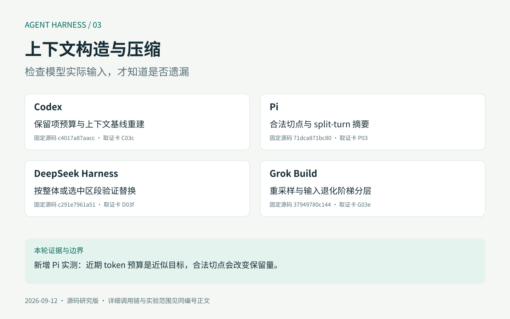
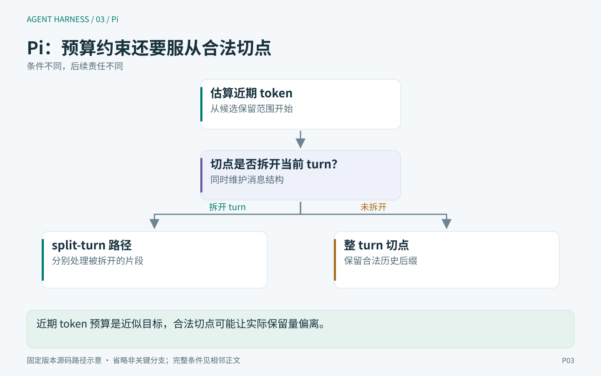
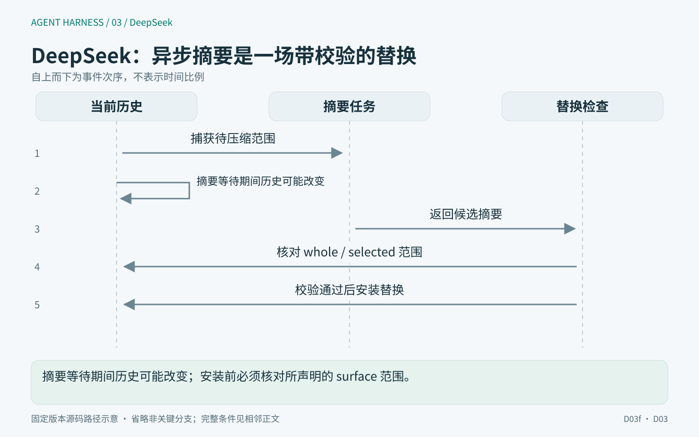
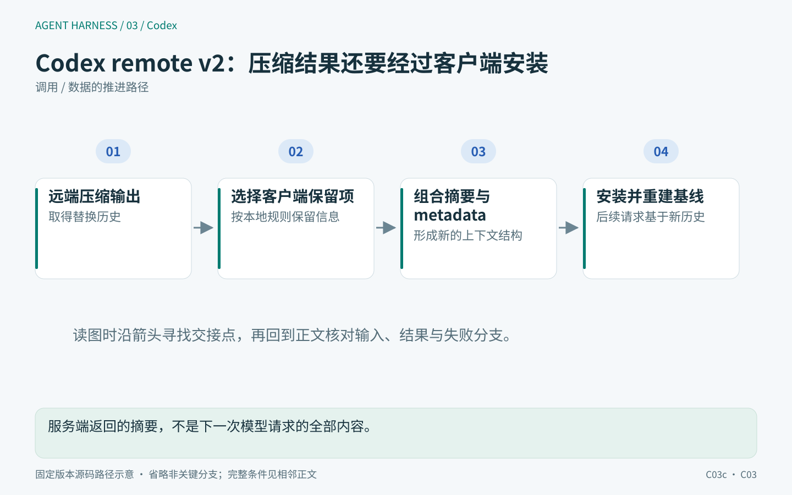
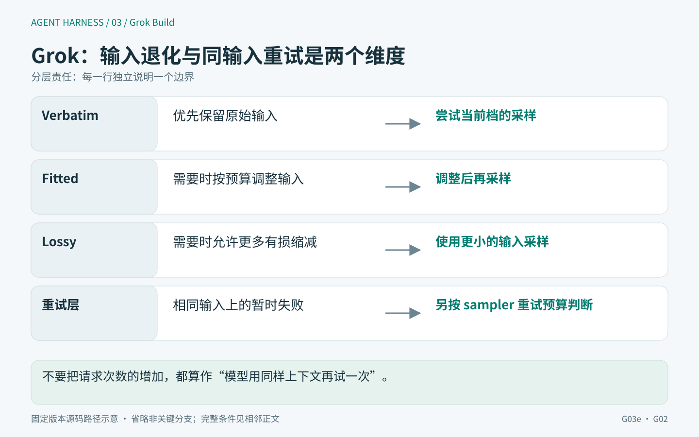
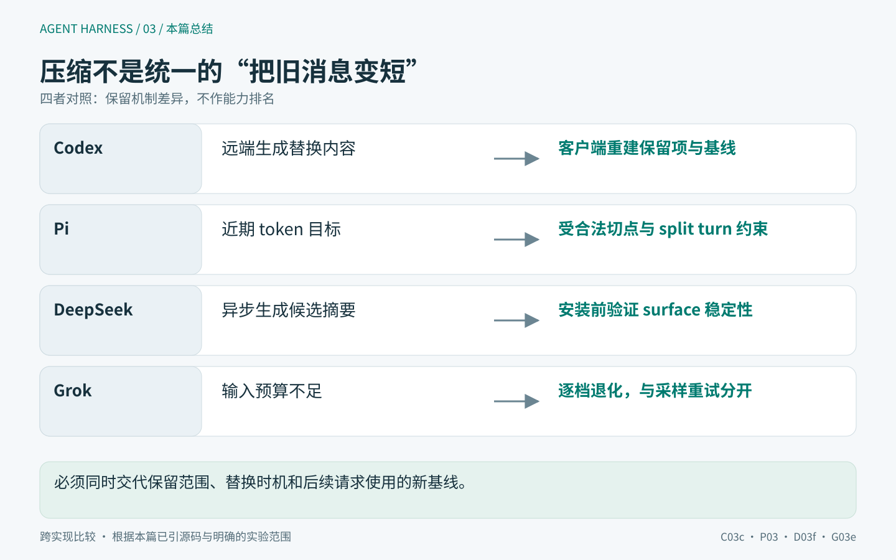

# 03｜上下文压缩如何保持一致？切点、替换与请求重建



任务开始时，用户要求“不修改配置文件，输出必须是 JSON”。几十次工具调用以后，Agent 违反了其中一条。直觉上可以说模型忘了，但修复前必须区分：原文还在日志里吗，压缩后的上下文还包含它吗，最终发出的请求包含它吗，模型收到后遵守了吗？

四个问题对应四种证据。原始日志里搜到一句话，不能证明本轮模型见过它；摘要里写了“遵守要求”，不能证明每条约束被准确保留；一次回答正确，也不能证明恢复与压缩的结构契约都没问题。

本文沿[固定提交](../evidence/versions.json)追查四种上下文构造与压缩路径。本文讨论公开源码中的客户端及运行时算法与状态，不推测闭源压缩服务的内部语义模型。2026-09-13 的实验调用了 Pi 切点算法的原始纯函数及边界用例，没有运行真实摘要模型。

> 版本与证据：源码基线固定于 2026-09-12，实验记录来自 2026-09-12 至 13 日；本文于 2026-09-14 润色，未重新执行实验。源码事实、局部实验观察与设计判断分别表述，不代表四产品端到端验收。详见[本篇实验说明](../evidence/EXPERIMENTS.md)。


## 先定义三份数据，以及一次压缩的成功条件

用 L 表示追加记录，S 表示当前被选中的可见上下文，R 表示经过模型协议转换的实际请求。最简单的依赖是 `L → S → R`，但长期记忆、工作区指令和实时工具集合还可能在 R 构造时进入。

压缩通常改变当前可见上下文 S，原始追加记录 L 则可能继续保留。一次成功压缩至少需要满足四个不同条件：

1. **选取合法。** 不把仍需配对的工具调用/结果拆开，不破坏请求协议结构。
2. **替换一致。** 摘要描述的源区段与提交时被覆盖的区段仍是同一份材料。
3. **预算有效。** 新视图能降低下一次请求压力；同时明确计量是估算还是 provider 实测。
4. **重建可解释。** 后续恢复能知道哪些原文被替换、保留了哪些提示与元数据。

语义保留质量是第五个独立问题，需要任务与模型实验。前四个条件即使都满足，也可能得到结构合法但遗漏关键内容的摘要；反过来，一段好摘要也可能被错误地覆盖到已变化的会话上。

## Pi：请求时变换与持久压缩，不应混成一个接口

### `transformContext` 不自动修改原始会话

<!-- harness-diagram:03-pi -->



*图 03 · Pi：近期 token 预算是近似目标，合法切点可能让实际保留量偏离。*

图示依据：[P03](https://github.com/earendil-works/pi/blob/71dca871bc80b6bc97be37f0ca3189399d651fff/packages/agent/src/harness/compaction/compaction.ts#L311-L418)。固定版本源码示意；省略的条件与实验边界见本节正文。

<!-- /harness-diagram -->

core 的 `streamAssistantResponse` 先取 `context.messages`，可选执行 `transformContext`，再经 `convertToLlm` 构造 provider 输入。前者仍处理 `AgentMessage`，后者才负责 provider 可接受的消息形态。[实际调用顺序](https://github.com/earendil-works/pi/blob/71dca871bc80b6bc97be37f0ca3189399d651fff/packages/agent/src/agent-loop.ts#L279-L319)

一个变换函数可以每轮重注入约束、裁剪旧内容，调用方也可以捕获最终 streamFn 输入。但返回一个新数组并不等于创建持久化 compaction entry；如果函数原地修改传入对象，那又会产生另一种共享状态影响。不能仅凭“存在 transformContext”就断言原始历史永远不受影响。

此前的局部实验采用新数组，确认第二次 provider 输入包含显式约束且短于当前完整消息集合。它只证明“发送了约束”，没有真实模型，所以不证明“记住了约束”。持久压缩还需要继续进入 Harness 层。

### 切点的合法性：不能从 toolResult 开始保留

`findValidCutPoints` 允许 user、assistant 及部分产品消息成为切点，排除 toolResult。`findCutPoint` 从末尾累加估算 token，达到 keepRecentTokens 后，寻找索引大于或等于该位置的合法切点；若切在用户 turn 内，还向前寻找 turnStartIndex。[切点实现](https://github.com/earendil-works/pi/blob/71dca871bc80b6bc97be37f0ca3189399d651fff/packages/agent/src/harness/compaction/compaction.ts#L311-L418)

这个“向右寻找合法切点”值得单独推导。考虑四项历史：

```text
0 user：任务
1 assistant：调用工具 A
2 toolResult：很长的 A 结果
3 assistant：短结论
```

从后向前累计时，预算阈值可能落在 2。因为 2 不能作保留起点，算法选择 3，保留的近期内容可能比目标少。此时 `isSplitTurn=true`、`turnStartIndex=0`，告诉后续摘要流程：保留尾部失去了发起这一 turn 的上下文，需要补一段 turn prefix summary。

2026-09-13 的原函数实验把预算设为 10，阈值落在一份 100 个估算 token 的工具结果上，得到切点 3，仅保留估算 1 token 的短结论。这个结果直接反驳“至少保留 keepRecentTokens 个 token”的误读。[切点实测](../evidence/protocol-context-results.json)

### 同一算法为什么也可能保留得比预算多

把上例最后的 assistant 短结论去掉，历史以 toolResult 结束。阈值仍落在工具结果位置，却找不到更靠右的合法切点。当前实现保留初始化的 `cutPoints[0]`，本实验中就是 0，于是整段都保留。

这不是模型摘要质量问题，而是切点选择规则。相同预算 10，返回的 retained estimate 大于 100。`keepRecentTokens` 因此是**近似目标，不是严格上下限**。这段纯函数的结果是否导致完整产品随后重试、跳过或进一步压缩，还需要连同调用方验证，不能据一个切点测试直接断言产品陷入无限循环。

另一个限制是 token 估算：这里的文本按字符启发式估算，图片使用固定估算值；它不是目标模型 tokenizer 的精确计价。阈值结果必须结合协议包装、工具 schema 和 provider usage 解读。[计量函数](https://github.com/earendil-works/pi/blob/71dca871bc80b6bc97be37f0ca3189399d651fff/packages/agent/src/harness/compaction/compaction.ts#L245-L310)

### split turn 摘要补的是什么信息

`prepareCompaction` 把材料分为历史 messagesToSummarize、当前 turn 的 turnPrefixMessages、原样保留的 retainedTail。若存在前次 compaction，还会把此前 retainedTail 展开成虚拟 entries，与后来消息一起参与新切点选择；previousSummary 则作为摘要输入继续传递。[准备阶段](https://github.com/earendil-works/pi/blob/71dca871bc80b6bc97be37f0ca3189399d651fff/packages/agent/src/harness/compaction/compaction.ts#L636-L707)

生成时，split turn 分支分别处理较早历史和当前 turn prefix，将两份结果组合，再附加读过/修改过的文件列表。并不是简单地“取数组前半部分总结，后半部分保留”。[生成与文件信息](https://github.com/earendil-works/pi/blob/71dca871bc80b6bc97be37f0ca3189399d651fff/packages/agent/src/harness/compaction/compaction.ts#L774-L821)

从设计上看，这种结构有助于让模型在保留近期细节时，仍知道这些细节属于什么未完任务。代价是可能多一次摘要调用，以及 previous summary 随多次压缩累计失真的风险。文件列表保留操作索引，也不等于文件当前内容已经重新读取；恢复时依旧需要核对工作区事实。

## DeepSeek：摘要是一场带来源校验的异步替换事务

### 为什么需要比较当前上下文的内容与位置

<!-- harness-diagram:03-deepseek -->



*图 03 · DeepSeek：摘要等待期间历史可能改变；安装前必须核对所声明的 surface 范围。*

图示依据：[D03f](https://github.com/deepseek-ai/deepseek-harness/blob/c291e7961a515f6d7af9304e7fd1d257929aef26/packages/compaction/compaction-basic/src/region.ts#L416-L453)、[D03](https://github.com/deepseek-ai/deepseek-harness/blob/c291e7961a515f6d7af9304e7fd1d257929aef26/packages/compaction/compaction-basic/src/region.ts#L1-L110)。固定版本源码示意；省略的条件与实验边界见本节正文。

<!-- /harness-diagram -->

DeepSeek 把会话日志与当前可见上下文（surface）分开。surface 用序号（seq）指向当前参与请求的记录。压缩选择使用当前 surface positions 对应的 seq，准备时同时取得按当前路由计量 token 后的 selected nodes、原始 seq 范围和摘要输入。[选择与准备](https://github.com/deepseek-ai/deepseek-harness/blob/c291e7961a515f6d7af9304e7fd1d257929aef26/packages/compaction/compaction-basic/src/region.ts#L111-L155)、[定价快照](https://github.com/deepseek-ai/deepseek-harness/blob/c291e7961a515f6d7af9304e7fd1d257929aef26/packages/compaction/compaction-basic/src/region.ts#L336-L414)

只记录日志长度无法证明一致性：一个工具结果可能被重新投影、一个区段可能被替换，即使目标 seq 数量没变，所代表的输入或预算也可能变了。因此，摘要生成后的检查需要比较具体节点及其计量结果，仅检查数量不足以确认一致性。

自动选择近期保留区时，它从尾部累计 tokens，再把保留边界向左移动到工具配对平衡的位置。与 Pi 的合法切点向右选不同，这种方向可能保留更多原始交互。不能在没有同一语料和计量器的前提下，宣称哪一种“更节省 token”；先应确认它们保全的结构单位不同。

### 两种稳定性策略，允许的并发修改不同

`whole-surface` 在摘要完成后重测整个 surface，要求 nodes 与先前 measurement 深相等。任何被计入这份测量的变化都可能使摘要失效。

`selected-span` 只要求目标仍存在、连续、工具配对平衡，seq 列表与定价后的 selected nodes 都不变。目标之外追加的内容可以继续存在，不必把正在生成的摘要废掉。[两种稳定性检查](https://github.com/deepseek-ai/deepseek-harness/blob/c291e7961a515f6d7af9304e7fd1d257929aef26/packages/compaction/compaction-basic/src/region.ts#L416-L453)

用一个简单交错即可看出它们的设计差异：

```text
开始摘要区段 [A, B]
摘要期间追加 C
whole-surface：如果 C 改变整体测量，拒绝旧摘要提交
selected-span：[A,B] 仍保持原状时，可以替换成 summary，保留 C
```

这相当于不同范围的乐观并发校验。检查范围越大，推理越简单，但不相干追加也会浪费已完成的摘要工作；范围越小，允许并发更多，就越需要精确的身份、位置、配对和token 计量不变量。

注意源码不是简单比较一个 generation 整数。一个节点 seq 相同但内容或计价变化，同样可能导致拒绝。因此“区段没移动”不足以证明它仍是同一个有效替换对象。

### 不能用摘要正文长度证明压缩有效

准备阶段分别记录 heuristic token count 与 route-priced token count。前者服务日志投影的 shadow-price 协议，后者参与保留选择和缩减比较。这里的 price/cost 指 token 计量，用于估算上下文压力，不是货币费用。摘要生成后，还要把它包装成真实 checkpoint message，再估算这个包装后的成本，并要求它严格小于原选中区段的 route cost。[缩减检查](https://github.com/deepseek-ai/deepseek-harness/blob/c291e7961a515f6d7af9304e7fd1d257929aef26/packages/compaction/compaction-basic/src/region.ts#L336-L414)

如果只看 summary 字符串短了多少，会漏掉来源标记和 carrier 格式等开销。反过来，将两种不同单位的计价混用，也可能让“缩短了”与下一次请求是否更轻互相矛盾。

即便通过这项检查，也只证明估算压力下降。它不证明摘要完整保留了业务约束，更不保证下一次请求的全部工具/系统提示都已计入某个严格上限。

### 事务起止记录怎样帮助识别不完整替换

`compactSurfaceRegion` 在首次 await 摘要前，先同步校验 owner 与已有锁，再写 compaction/start。这条未闭合 start 成为会话层的忙碌标记。摘要完成并验证稳定性后，写 compaction/summary、带 replace surfaceOp 的 user/message，再写 compaction/end。[事务驱动](https://github.com/deepseek-ai/deepseek-harness/blob/c291e7961a515f6d7af9304e7fd1d257929aef26/packages/compaction/compaction-basic/src/region.ts#L173-L275)、[替换体](https://github.com/deepseek-ai/deepseek-harness/blob/c291e7961a515f6d7af9304e7fd1d257929aef26/packages/compaction/compaction-basic/src/region.ts#L456-L508)

替换消息的 provenance 指向 start、summary 和被遮蔽的源 seq。这使后续解释器能够回答：这段摘要覆盖了什么材料、来自哪次事务，而不是从自然语言里猜。

失败处理中，summary 阶段、commit 阶段、关闭失败和 flush 失败被区分。如果 end 写入失败，代码故意让未配对 start 留在记录中，便于后续识别不完整事务。manual compaction 还会按可选 flush 的结果报告 persistence 错误。

这里“没有 await 地连续 append”最多减少异步插入的窗口，不等于底层存储在断电时具备数据库事务原子性。一次部分写入仍需要恢复逻辑解释。不能把函数名 transaction 或日志中的 end 直接当成磁盘持久保证。

## Codex remote v2：服务端压缩输出之外，客户端还重建哪些内容

### 先验证响应形状，再谈摘要安装

<!-- harness-diagram:03-codex -->



*图 03 · Codex：服务端返回的摘要，不是下一次模型请求的全部内容。*

图示依据：[C03c](https://github.com/openai/codex/blob/c4017a87aacc7558002b7cb510025e967c1d765e/codex-rs/core/src/compact_remote_v2.rs#L484-L583)、[C03](https://github.com/openai/codex/blob/c4017a87aacc7558002b7cb510025e967c1d765e/codex-rs/core/src/compact_remote_v2.rs#L1-L140)。固定版本源码示意；省略的条件与实验边界见本节正文。

<!-- /harness-diagram -->

本文研究的是 remote v2 路径，不代表 Codex 所有压缩实现。客户端消费压缩流时要求看到 response.completed，并要求恰好一个 Compaction output item；数量不对属于 fatal，流先结束则报 stream error。[输出验收](https://github.com/openai/codex/blob/c4017a87aacc7558002b7cb510025e967c1d765e/codex-rs/core/src/compact_remote_v2.rs#L423-L481)

这只验证客户端能依赖的协议结构。Compaction item 的内部语义压缩方式不是这份代码能证明的内容。把它称作“客户端完成了某种自然语言摘要算法”，会越过公开证据边界。

### 压缩后的历史不是只有一个黑盒摘要

`build_v2_compacted_history` 先按规则筛选保留项，执行预算裁剪，然后把 compaction output 追加进去。用户/Hook 消息、受功能开关与 client-authored metadata 约束的 developer 消息、部分 AgentMessage 都有具体保留条件；普通 assistant 对话和工具输出不自动原样保留。[筛选与组装](https://github.com/openai/codex/blob/c4017a87aacc7558002b7cb510025e967c1d765e/codex-rs/core/src/compact_remote_v2.rs#L484-L583)

AgentMessage 还区分子任务进度、完成信息和其它消息，并设置大小门槛。这说明保留策略利用来源与用途，不只是按时间删掉最旧 N 条。

随后客户端重建 initial context，并将它插入最后真实用户消息或 summary 之前；同时设置 reference context item、world-state baseline 和窗口 metadata，再调用 replace_compacted_history。[安装阶段](https://github.com/openai/codex/blob/c4017a87aacc7558002b7cb510025e967c1d765e/codex-rs/core/src/compact_remote_v2.rs#L299-L357)

因此，恢复下一轮模型输入需要两类东西：压缩后的内容，以及决定当前环境/工具/上下文基线的结构信息。只有摘要文字却没有正确基线，可能让已改变的工具或环境以错误增量重新装配。

### retained budget 有上限，但“保留用户消息”不代表原文永不丢

固定版本给 retained messages [64,000 token 的预算](https://github.com/openai/codex/blob/c4017a87aacc7558002b7cb510025e967c1d765e/codex-rs/core/src/compact_remote_v2.rs#L73-L77)；裁剪从新到旧按 source 与 attached notice 的 group 处理。一个 group 能放下就整体放入，边界处尝试截断，最后恢复正向顺序。[保留预算与裁剪](https://github.com/openai/codex/blob/c4017a87aacc7558002b7cb510025e967c1d765e/codex-rs/core/src/compact_remote_v2.rs#L599-L693)

把 notice 与来源一起处理的意义是保留解释关系。如果内容还在而说明它来源或限制的附属说明被独立删掉，模型可能以错误信任级别解读它。图像预算和 client-authored developer message 的计价又有单独分支，不能把 64,000 当成所有格式都按纯文本长度精确计算的总请求上限。

一旦 retained budget 耗尽，旧用户原文也可能不再保留。因此，“客户端偏向保留用户约束”与“开头每一条要求永久逐字保留”是两个不同主张。需要硬约束的产品仍应在结构化状态与实际执行门中保留规则，而不是仅寄望摘要和历史保留策略。

## Grok：区分“同一输入再采样”和“换一份更小的输入”

### 共享引擎处理重采样，shell 处理输入退化

<!-- harness-diagram:03-grok -->



*图 03 · Grok Build：不要把请求次数的增加，都算作“模型用同样上下文再试一次”。*

图示依据：[G03e](https://github.com/xai-org/grok-build/blob/37949780c144e37df692e3d669051a21fec24f20/crates/codegen/xai-grok-shell/src/session/compaction.rs#L1080-L1196)、[G02](https://github.com/xai-org/grok-build/blob/37949780c144e37df692e3d669051a21fec24f20/crates/codegen/xai-grok-shell/src/session/acp_session_impl/sampler_turn.rs#L1-L165)。固定版本源码示意；省略的条件与实验边界见本节正文。

<!-- /harness-diagram -->

共享 `sample_summary_with_retries` 接收已经准备好的 turns 和 compaction prompt。非空且不退化的摘要立即成功；空或退化结果可以在预算内重试；确定性错误与 context overflow 则立即返回，因为同一份过大输入再次发送不会自然变小。[共享采样循环](https://github.com/xai-org/grok-build/blob/37949780c144e37df692e3d669051a21fec24f20/crates/common/xai-grok-compaction/src/code_compaction/sample.rs#L82-L194)

shell 捕获带 `context_overflow` 的 FullReplaceError 后，才推进输入阶梯：`Verbatim → VerbatimFitted → Lossy`。VerbatimFitted 保持相应输入表示并按预算 fit；Lossy 则重新使用有损 summarization 表示及另一套预算。每次前进记录降级原因与阶段；阶梯耗尽后，直接报告失败，不再使用普通重试处理同一溢出。[实际输入阶梯](https://github.com/xai-org/grok-build/blob/37949780c144e37df692e3d669051a21fec24f20/crates/codegen/xai-grok-shell/src/session/compaction.rs#L1080-L1196)

两个循环分开承担这两类责任：内层处理相同输入的随机或暂时失败，外层处理输入本身不满足限制。若只把它们都记为“压缩重试”，就无法解释本次成功究竟来自第二次模型采样，还是因为丢弃了更多原始细节。

代价也必须保留：有损阶梯提高可继续性，却可能影响证据精度。生产诊断应显示使用了哪个输入阶段，以及原始记录是否仍可检索，而不是只显示一个“压缩成功”。

### 去掉模型草稿，不等于验证摘要语义

共享 summary formatter 会清理特定的开头 analysis/summary 包装，并处理正文中回显的控制标记；退化检查对清理后的 seed 长度设下限。[清理与退化判断](https://github.com/xai-org/grok-build/blob/37949780c144e37df692e3d669051a21fec24f20/crates/common/xai-grok-compaction/src/code_compaction/summary.rs#L18-L126)

这能防止模型只返回一小段模板或空壳，却不能判断摘要是否保留了“不修改配置文件”。一个足够长的错误摘要仍可能通过长度门；一段简洁但完整的摘要也可能触发重试。这里的规则应被理解为结构和退化防线，不是自动语义正确性评分。

### 重建器把一些事实放在摘要之外

共享 assembler 接受明确的 parts，构造类似 `[system, user prefix, project instructions?, last query?, recent…, summary, reminder?]` 的历史。近期消息放在摘要之前；项目指令与最后查询有各自的 carrier，不依赖摘要模型重新猜出来。[历史重建器](https://github.com/xai-org/grok-build/blob/37949780c144e37df692e3d669051a21fec24f20/crates/common/xai-grok-compaction/src/code_compaction/assemble.rs#L1-L98)

这与“把所有历史全部压成一条 system prompt”不同。保留稳定指令、近期事实和继续摘要的独立身份，便于后续区分来源，也有利于恢复和去重。但 caller 提供的 project instructions 是否来自最新文件，仍要看上层刷新策略；共享纯组装函数本身没有读取工作区的能力。

## 四套策略到底保住了什么

| 问题 | Pi Harness | DeepSeek compaction-basic | Codex remote v2 | Grok full-replace 路径 |
|---|---|---|---|---|
| 选择压缩材料 | 近期估算预算 + 合法消息切点 + split turn | route 计价 surface + 配对平衡边界 | 远端输入与客户端保留项策略 | shell 准备输入，溢出时推进阶梯 |
| 哪些内容原样保留 | retainedTail，后续可展开为虚拟 entries | 选中区段外的 surface | 符合规则及预算的消息、重建的 initial context | project instructions、last query、recent 等独立 parts |
| 异步替换的一致性 | 需结合会话提交路径；本篇只实测切点 | whole-surface / selected-span 后验校验 | 安装摘要和 reference/world-state 基线 | sampler/assembler 与 shell 状态管理分层 |
| “压缩有效”的局部判断 | 近似切点，生成结果与错误传播 | 包装 checkpoint 的估算成本严格下降 | compaction 协议形状与 retained budget | 非空/非退化；输入溢出另行退化 |
| 不能据此保证 | 近期 token 严格上限 | 摘要语义完整、断电原子提交 | 客户端可知远端语义算法、旧用户原文永存 | 长摘要必然正确、所有环境信息都最新 |

比较时需要先说明每个机制实际保护的对象，再判断应用还需要补充哪些保证。对长代码任务，结构合法性和工作区可回查通常同样关键；对高约束流程，还需要把授权与不可违反规则从自然语言摘要中独立出来。

## 用可复现切点反例约束结论

2026-09-13 补充的三项 Pi 纯算法实验分别验证：阈值落在 toolResult 时向右选合法切点；没有更靠右切点时保留量可能超过目标；在 user 边界切开时不标 split turn。构建器通过 TypeScript AST 从固定文件提取原样函数和常量，记录文件哈希与行范围，不改算法。[提取清单](../evidence/protocol-context-extraction.json)、[实际结果](../evidence/protocol-context-results.json)

这组实验没有加载完整 Pi Harness 的压缩提交与摘要调用，所以只能证明切点选择。DeepSeek 的 transaction、Codex remote v2 和 Grok 的完整阶梯在本轮为源码审读；不把清晰的控制流分析冒充端到端运行。

若继续测语义保留率，应先保存 L、压缩前 S、替换后 S 和实际 R，再用确定断言判断输出或副作用。否则“模型忘记了”的统计会把输入装配遗漏、摘要丢失、格式转换损失和模型不遵守四种原因混在一起。

## 我的设计判断：对内容做摘要，对契约做显式保存

我会把硬约束、授权与当前目标保存为有来源和覆盖规则的结构化状态，在请求装配和执行门重复核对。摘要承担对历史证据与进度的浓缩，不能成为唯一授权来源。这样做的代价是需要处理旧约束过期和用户新指令覆盖，而不是永久累加所有要求。

压缩接口则应返回来源区段、使用的模型/路由、输入阶段、估算变化和安装身份。需要并发追加时，参考 selected-span 的精细稳定性契约；需要更简单的实现时，可以选择 whole-surface 校验，但应接受频繁重做的成本。

最后，上下文检查器应展示请求发送边界上的实际内容，而不只展示聊天记录。它应让读者看见哪些内容被投影、裁剪、摘要或重新注入，并能回到原始来源。只有这条链完整，“Agent 为什么忘了”才能从一个笼统评价变成可以定位和修复的工程问题。

<!-- harness-diagram:03-summary -->



*图 03 · 本篇总结：必须同时交代保留范围、替换时机和后续请求使用的新基线。*

图示依据：[C03c](https://github.com/openai/codex/blob/c4017a87aacc7558002b7cb510025e967c1d765e/codex-rs/core/src/compact_remote_v2.rs#L484-L583)、[P03](https://github.com/earendil-works/pi/blob/71dca871bc80b6bc97be37f0ca3189399d651fff/packages/agent/src/harness/compaction/compaction.ts#L311-L418)、[D03f](https://github.com/deepseek-ai/deepseek-harness/blob/c291e7961a515f6d7af9304e7fd1d257929aef26/packages/compaction/compaction-basic/src/region.ts#L416-L453)、[G03e](https://github.com/xai-org/grok-build/blob/37949780c144e37df692e3d669051a21fec24f20/crates/codegen/xai-grok-shell/src/session/compaction.rs#L1080-L1196)。跨实现比较 · 根据本篇已引源码与明确的实验范围。

<!-- /harness-diagram -->
