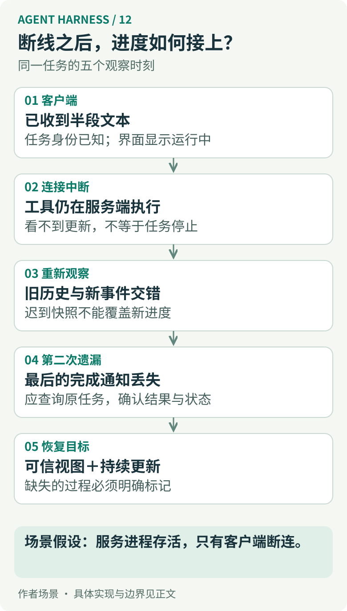
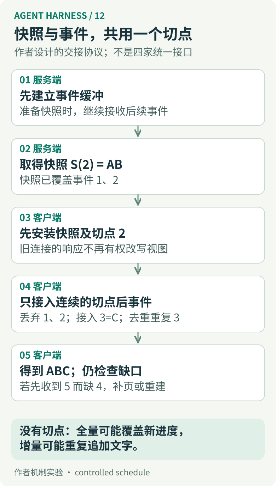
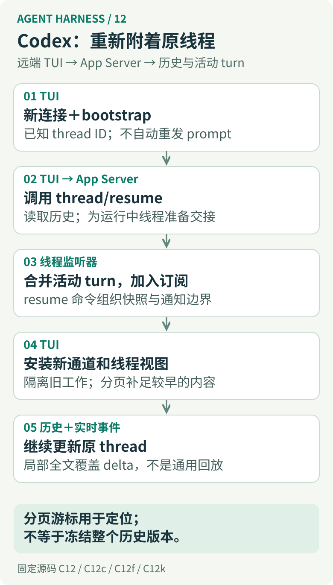
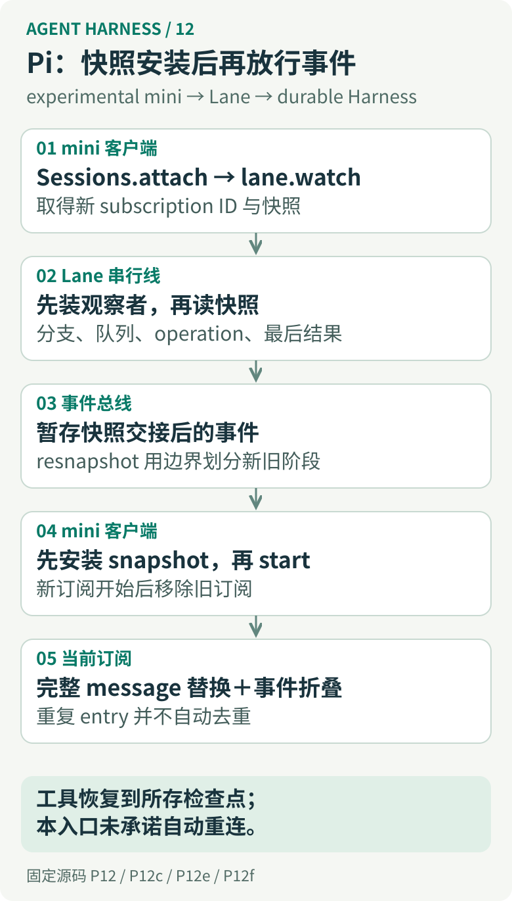
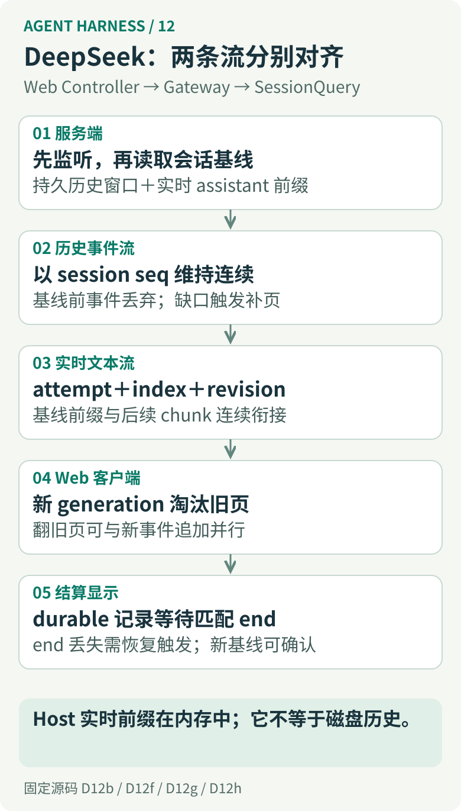
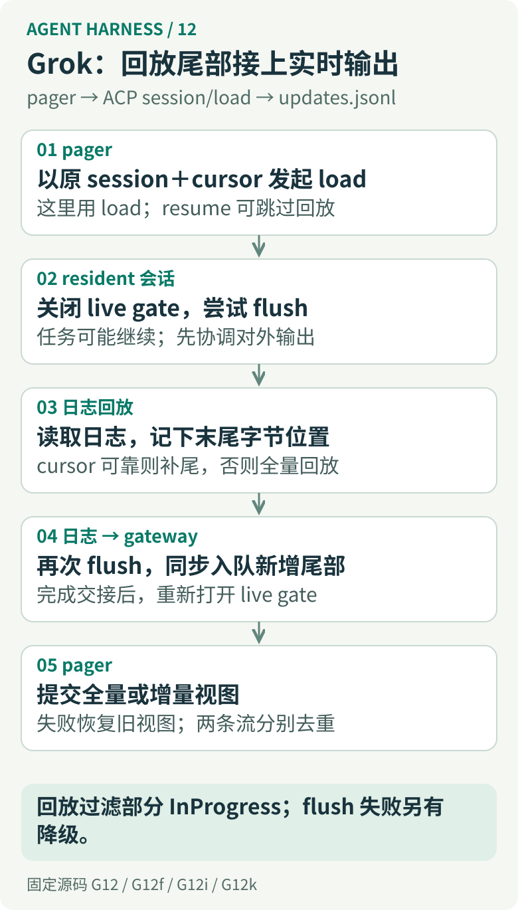
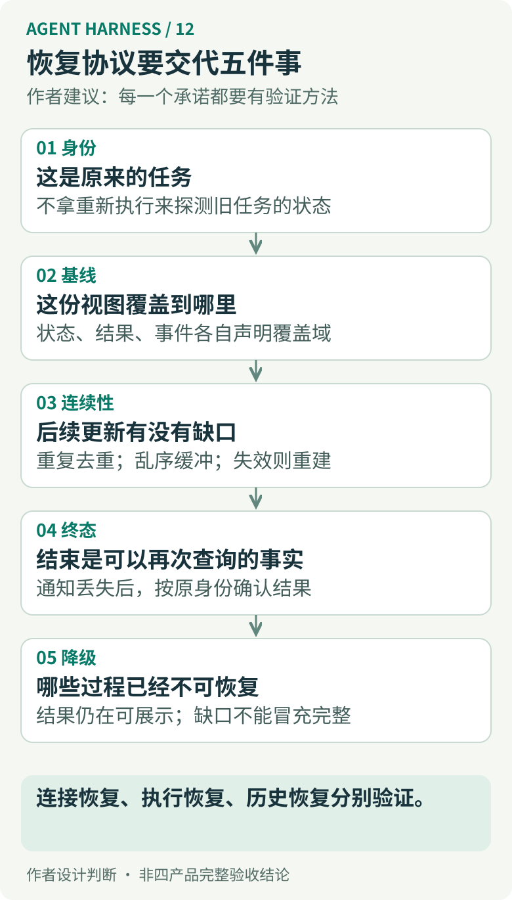

# 12｜断线之后，Agent 的进度如何接上？四个 Harness 的状态同步与事件恢复

屏幕上的回答停在“正在检查第二个文件”。网络断了，但服务端的工具还在运行。几秒后，客户端重连，开始拉取历史；就在旧分页响应返回前，新一段文本先到了。工具随后完成，最后一条完成通知却再次丢失。界面应该继续显示“运行中”，清空重画，还是提示用户再发一遍？

这个场景里最危险的动作，是把“我没看到”当成“它没发生”。重发请求可能启动第二次执行，读一次历史又可能覆盖刚收到的新进度。连接恢复只是第一步；真正需要恢复的是一份有来源、有边界、还能继续更新的视图。

[第 06 篇](https://aresning.github.io/agent-harness/06-recovery/)讨论执行失败之后，运行时凭什么继续、重放或拒绝；[第 09 篇](https://aresning.github.io/agent-harness/09-clients/)讨论请求接纳、执行完成和客户端确认分别承诺什么。本篇沿着客户端、服务端与记录层，把“已经有任务身份，但观察链断了”继续拆下去。比较基于同一组[固定源码](../evidence/versions.json)，补充审读及实验日期为 2026-09-14。Pi 与 DeepSeek 的实际模块实验、Codex 与 Grok 的原函数提取实验，以及作者设计的反例分别标明；没有运行四产品完整网络重连或真实模型任务。

## 一、到底要接回什么：结果、状态、历史和持续观察

先给开头的任务一个稳定身份 `operation-1`。它产生的东西至少有四类。

**结果**是该任务最后提交的回答、文件修改说明或错误。**当前状态**回答它此刻仍在执行、等待审批，还是已经结束。**事件历史**描述过程中发生过哪些变化。**持续观察**则是一项连接关系：当前客户端会不会继续收到后续变化。

四者能够互相辅助，却不能互相替代。结果文件存在，不足以确定整个任务已经结束；当前状态是 completed，也不会还原所有中间文本；拿到完整历史，仍可能错过查询结束到订阅建立之间的事件。反过来，即使产品有意不保存每次工具进度，仍可以通过完整结果和当前状态恢复一个可用界面。

| 故障 | 还活着的东西 | 应先确认的事实 | 不能默认采用的动作 |
|---|---|---|---|
| 客户端断连 | 服务进程、任务与存储可能都还在 | 原任务身份、最新状态、重新观察的起点 | 再次提交相同任务 |
| 服务进程重启 | 只有已保存记录和独立存活的资源可能还在 | 任务是否重建、结果是否耐受崩溃、工具是否仍被托管 | 把旧 running 标记当成仍在运行 |
| 历史被清理或压缩 | 当前快照、结果和事件可能具有不同保留期 | 哪些记录仍可查询，旧游标是否有效 | 假装缺失区间已经完整补回 |

本篇的主场景首先假设**只有客户端连接中断**。涉及进程重启或历史过期时再改变这个条件。这样才能避免一种常见混淆：某条重连路径能接回存活任务，不等于它能复活被杀死的工具；能恢复工具结果，也不等于能重新播放每一次百分比更新。

## 二、全量与增量为什么会互相伤害

假设服务器先生成快照 `S(2) = "AB"`，其中已经包含事件 1 和 2；但它的网络响应很慢。客户端先收到事件 3，把文本推进到了 `"ABC"`，随后又用迟到的 `S(2)` 覆盖界面，文本退回 `"AB"`。如果改成“快照后把缓冲事件全加上”，事件 1、2 又可能被重复追加，变成 `"ABAB…"`。

<!-- harness-diagram:12-race -->

*图 12 · 竞态：先建立缓冲，再取得快照切点。快照覆盖切点之前的内容，只接入切点之后的连续变化。本图是作者提出的协议模型，并非四家的统一实现。*

<!-- /harness-diagram -->

这里需要的不是一个笼统的 `id`，而是明确区分不同字段承担的责任：

| 字段 | 能回答什么 | 单独不能回答什么 |
|---|---|---|
| task / turn / operation ID | 更新属于哪项工作 | 哪个更新更晚、哪些更新已经应用 |
| item / message / toolCall ID | 应更新哪一个对象 | 同一对象的新旧版本；只按 ID 去重可能误删更新 |
| 事件序号或回放游标 | 从哪里继续，或是否重复 | 快照是否覆盖这个位置；是否已耐受崩溃 |
| 状态版本 / 快照切点 | 全量内容覆盖到哪里 | 不同流是否共享同一个序列 |
| 连接 generation / subscription ID | 是否来自当前观察关系 | 全局业务顺序、任务有没有完成 |
| transport sequence | 传输层帧的位置 | 业务事件是否已落盘，是否已经反映到界面 |

对**完整对象替换**，重复应用同一份内容可能没有可见影响；对“追加一段文本”这样的 **delta**，重复一次就是重复字符。对有序事件序列，收到 105 不代表 103、104 已经收到。对旧世代分页响应，即使它本身内部一致，也不应覆盖新世代已经安装的视图。

作者建议先定义一个能检验的交接契约：快照必须说明覆盖域和切点；订阅必须说明切点之后从哪里开始；客户端必须说明如何处理重复、缺口与旧世代。接下来会看到，四家并没有都提供一个公共 `snapshotVersion` 字段，而是用不同的串行边界、缓冲、回放门和局部序号完成其中一部分。

## 三、Codex：重新附着线程，重建视图，并隔离旧连接的尾巴

### 从实际 TUI 重连入口进入

这里分析的是连接外部 App Server 的 TUI。`reconnect` 明确拒绝 Embedded 情况，因为进程内会话没有远端连接可恢复。远端路径新建连接、执行 bootstrap，再对原 thread 调用 `resume_thread`；重试间隔为 0、1、2、4、8 秒，整个连接与历史恢复过程共用 120 秒预算。这个数字是该实现的重连预算，不是任务完成或历史加载的服务等级承诺。[重连入口](https://github.com/openai/codex/blob/c4017a87aacc7558002b7cb510025e967c1d765e/codex-rs/tui/src/app/reconnect.rs#L30-L125)

如果初始请求可能已创建 thread，却连 thread ID 都没收到，代码会直接拒绝自动重试，并让用户先检查已有任务。这是很具体的安全选择：系统连应该观察哪项工作都无法确定时，不以“恢复网络”为理由重新创建工作。[同一分支](https://github.com/openai/codex/blob/c4017a87aacc7558002b7cb510025e967c1d765e/codex-rs/tui/src/app/reconnect.rs#L30-L125)

<!-- harness-diagram:12-codex -->

*图 12 · Codex：恢复对象是原 thread 的视图。运行中线程的监听器负责组织 resume 响应与订阅交接，客户端随后继续补历史；不是重发原 prompt。[客户端入口](https://github.com/openai/codex/blob/c4017a87aacc7558002b7cb510025e967c1d765e/codex-rs/tui/src/app/reconnect.rs#L30-L125)、[服务端交接](https://github.com/openai/codex/blob/c4017a87aacc7558002b7cb510025e967c1d765e/codex-rs/app-server/src/request_processors/thread_lifecycle.rs#L563-L774)。*

<!-- /harness-diagram -->

### 快照与实时事件如何接上

`resume_thread` 根据历史能力选择分页模式，必要时走旧协议兼容路径；初始恢复并不强制装入整个会话。服务端对仍在运行的线程，使用监听器命令处理 resume：读取活动 turn 快照，把它合并进历史或首屏 turn 页，规范化状态，再把新连接加入订阅并发送响应。把这项操作放进线程监听器的命令路径，是它协调快照与后续通知的关键位置。[客户端历史恢复](https://github.com/openai/codex/blob/c4017a87aacc7558002b7cb510025e967c1d765e/codex-rs/tui/src/app_server_session/rollout_history.rs#L94-L207)、[监听器命令](https://github.com/openai/codex/blob/c4017a87aacc7558002b7cb510025e967c1d765e/codex-rs/app-server/src/thread_state.rs#L45-L100)、[活动 turn 与订阅处理](https://github.com/openai/codex/blob/c4017a87aacc7558002b7cb510025e967c1d765e/codex-rs/app-server/src/request_processors/thread_lifecycle.rs#L563-L774)

这不等于数据库历史、所有工具瞬时输出和跨多次分页查询被一个全局事务同时冻结。这里可以确认的是**运行中线程的 resume 交接路径**；不能把它扩大为“任何 `thread/read` 后再监听都没有窗口”，更不能据此声称断线期间所有 delta 都会逐条重播。

客户端也承担恢复责任。重连完成时换用新的事件通道、处理后台线程恢复状态，并隔离旧异步工作；否则旧连接尚未结束的分页或事件处理任务会继续污染新界面。重连要恢复的不只是 socket，还包括谁有权再写这份视图。[重连安装阶段](https://github.com/openai/codex/blob/c4017a87aacc7558002b7cb510025e967c1d765e/codex-rs/tui/src/app/reconnect.rs#L255-L380)

### 长历史和重复内容怎么处理

TUI 的首轮历史预算是 5 个 turn，item 页大小 100，初始扫描上限为 400 个 item；这是源码常量定义的装载预算，不代表每次恰好传输这些数量。历史分页检查加载标记及游标是否仍匹配，并记录已见游标，避免重复游标让扫描死循环。合并历史 item 时按已有 ID 判断是否插入，它不是一个按公共 `updatedVersion` 通用替换对象的同步器。[分页预算与请求检查](https://github.com/openai/codex/blob/c4017a87aacc7558002b7cb510025e967c1d765e/codex-rs/tui/src/app_server_session/history.rs#L26-L122)、[历史合并](https://github.com/openai/codex/blob/c4017a87aacc7558002b7cb510025e967c1d765e/codex-rs/tui/src/app_server_session/history.rs#L163-L300)

服务端两条历史路径也不同。legacy `thread/turns/list` 每次可能重读整个 rollout 并重建 turn，注释明确提到 rollback、compaction 能改变前面的 turn。ThreadStore 的游标包含 thread 身份、rollout ordinal、是否包含锚点和查询范围；这是一种定位及范围检查，不是“整个会话被冻结在版本 V”的凭证。`thread/items/list` 走创建顺序，公开结果没有把内部更新 ordinal 作为通用更新水位返回。[legacy 重建](https://github.com/openai/codex/blob/c4017a87aacc7558002b7cb510025e967c1d765e/codex-rs/app-server/src/request_processors/thread_processor.rs#L3015-L3102)、[游标结构](https://github.com/openai/codex/blob/c4017a87aacc7558002b7cb510025e967c1d765e/codex-rs/thread-store/src/local/thread_history/read.rs#L31-L46)、[范围校验](https://github.com/openai/codex/blob/c4017a87aacc7558002b7cb510025e967c1d765e/codex-rs/thread-store/src/local/thread_history/read.rs#L249-L278)、[item 查询](https://github.com/openai/codex/blob/c4017a87aacc7558002b7cb510025e967c1d765e/codex-rs/app-server/src/request_processors/thread_processor.rs#L3374-L3433)

还有一个容易被夸大的小机制：TUI 回放过滤器看到匹配的完整 `ItemCompleted` 时，可以抑制局部缓冲中已被它覆盖的 assistant 文本 delta。它依据 thread、turn、item 身份，且扫描有局部边界；这是一项减少重复渲染的优化，不是任意网络乱序下的日志去重协议。[回放过滤](https://github.com/openai/codex/blob/c4017a87aacc7558002b7cb510025e967c1d765e/codex-rs/tui/src/app/replay_filter.rs#L75-L108)

回到开头：只要原 thread 可恢复，TUI 可以用历史和活动状态重新建立可信视图；完整 item 到达后，不必把缺失的每个字符都重演一遍。若最后的完成通知再丢失，恢复原 thread 并读取它的状态与记录，比重新 `turn/start` 更接近问题本身。本轮没有验证四种故障同时发生时的完整 TUI 行为，也没有证明所有工具进度都会进入可恢复历史。

## 四、Pi：durable Lane 提供快照＋缓冲，但实验性客户端不等于全部 Pi

### 先选对入口

第 09 篇分析的是 Pi 的 stdio RPC。这里为了研究可附着的状态视图，选择仓库中的 **experimental mini 客户端**和 durable Harness 的 Lane API。不能把 mini 的能力直接安到普通 RPC 上，也不能把实验目录里的实现写成整个产品的稳定公开承诺。

mini `connect` 先建立 peer，调用 `Sessions.attach`，随后执行 `lane.watch(presentationId)`。拿到 `snapshot` 与 `subscriptionId` 后，先把快照安装到 UI，再调用 `lane.start(subscriptionId)` 释放后续事件；切换订阅时，旧订阅在新订阅启动后注销，客户端只接纳当前 subscription ID 的事件。遇到 reducer 返回 rebase，则重新取得一份快照。[mini 接入与替换](https://github.com/earendil-works/pi/blob/71dca871bc80b6bc97be37f0ca3189399d651fff/packages/coding-agent/src/experimental/mini/tui/session.ts#L53-L111)

<!-- harness-diagram:12-pi -->

*图 12 · Pi：watch 与快照位于 Lane 的串行读取路径，start 把已建立的观察关系交给 UI。subscription ID 负责排除旧订阅，并不是供磁盘日志回放的事件游标。[Lane 快照](https://github.com/earendil-works/pi/blob/71dca871bc80b6bc97be37f0ca3189399d651fff/packages/agent/src/harness/runtime/lane.ts#L1705-L1770)、[mini 客户端](https://github.com/earendil-works/pi/blob/71dca871bc80b6bc97be37f0ca3189399d651fff/packages/coding-agent/src/experimental/mini/tui/session.ts#L53-L111)。*

<!-- /harness-diagram -->

这个 `connect` 函数提供附着与重建过程；它本身没有展示一套自动物理断线重连循环。因此“重新调用这条路径能建立观察”与“产品会自动在几秒内重连”必须分开。本文没有测量后一种体验。

### 快照从哪里来，为什么不会漏在 watch 中间

Lane 的 `readLane` 和状态修改都进入 session 的 mutation 串行线。`watch` 在这条线内先安装缓冲观察者，再读取快照；快照失败会取消观察者。这样避免在“读完状态、尚未开始监听”的空档遗漏下一项变更。服务端把 watch 句柄与随机 subscription ID 保存起来，`start` 再开始消费缓冲。[串行读取](https://github.com/earendil-works/pi/blob/71dca871bc80b6bc97be37f0ca3189399d651fff/packages/agent/src/harness/runtime/lane.ts#L307-L386)、[watch 顺序](https://github.com/earendil-works/pi/blob/71dca871bc80b6bc97be37f0ca3189399d651fff/packages/agent/src/harness/runtime/lane.ts#L1705-L1770)、[服务端句柄](https://github.com/earendil-works/pi/blob/71dca871bc80b6bc97be37f0ca3189399d651fff/packages/coding-agent/src/experimental/mini/worker/lane-service.ts#L32-L82)

`resnapshot` 则比“再查一次”更细：事件总线切换 epoch，先丢弃将由新快照代表的旧阶段事件，在快照边界之后暂存新事件，安装快照后再释放。这里的边界需要调用者在一致的状态读取期间标记；只孤立地使用一个通用事件总线，不能自动获得 Lane 存储的串行保证。[事件总线](https://github.com/earendil-works/pi/blob/71dca871bc80b6bc97be37f0ca3189399d651fff/packages/agent/src/harness/events.ts#L1-L286)

实际运行原 `HarnessEventBus` 的实验确认：start 之前的事件被缓冲；resnapshot 切点之前的受控事件没有再次投递，切点之后的事件得到保留。也复现了失败边界：如果 resnapshot 抛错，已经压掉的旧阶段事件不会突然回来。调用者应重新取得可信快照，不能把这个观察者当作无缺口历史继续使用。[12 项原模块实验](../evidence/client-recovery-results.json)

### “正在运行”的快照能有多完整

`captureLaneSnapshot` 复制 Lane 状态，沿当前分支读到 compaction 边界，读取队列、统计和最后一次 operation 的结果。未完成 assistant 消息可从保存的 frames 重建；工具处于 effect_pending 时读的是已保存的 `pendingToolOutput` 检查点，到了 outcome_ready 才使用已准备的结果。它没有保证每一次临时进度回调都进入这个快照。[快照与结果](https://github.com/earendil-works/pi/blob/71dca871bc80b6bc97be37f0ca3189399d651fff/packages/agent/src/harness/runtime/lane.ts#L1705-L1770)、[未完成操作](https://github.com/earendil-works/pi/blob/71dca871bc80b6bc97be37f0ca3189399d651fff/packages/agent/src/harness/runtime/lane.ts#L1770-L1868)

这给出两个不同的保留边界：compaction 决定当前 transcript 的可见前缀；工具输出检查点决定正在运行的工具能重建到哪里。二者都不能简单写成“保留最近 N 天事件”。在这些路径中没有找到统一的、可直接承诺给客户端的历史 TTL；这表示本轮证据不足以给出该数字，不表示永不清理。

reducer 对 `message_update` 用完整 message 替换，所以连续收到 `A`、`AB`、`AB`，最终仍是 `AB`；但 `entry_added` 直接追加 transcript，重复投递同一 entry 会留下两份。原 reducer 实验确实得到这个差异。它依赖有序、受控的 watch 交付关系，不是一套接受任意重复网络事件的通用折叠算法。[reducer](https://github.com/earendil-works/pi/blob/71dca871bc80b6bc97be37f0ca3189399d651fff/packages/agent/src/harness/runtime/reducer.ts#L1-L232)、[实验结果](../evidence/client-recovery-results.json)

最后的 `run_end` 丢了怎么办？重新取得 Lane 快照可以重新确认当前 operation 与最后结果；如果关心的 operation 已经不是“最后一个”，底层还有按 operation ID 的 `getResult` 查询。这里说明的是 Harness 能力，不代表 mini 界面已暴露全部查询按钮。[按 operation 查询](https://github.com/earendil-works/pi/blob/71dca871bc80b6bc97be37f0ca3189399d651fff/packages/agent/src/harness/runtime/lane.ts#L270-L282)

代价也藏在这个设计里：重建快照需要读取当前分支和未完成操作材料；开始消费前需要保存缓冲。服务端源码还特别提醒，创建后一直不 start 的 watch 会持续积累事件。好用的原子交接需要配套订阅清理和资源预算，不能只看到“先缓冲”三个字。[watch 生命周期](https://github.com/earendil-works/pi/blob/71dca871bc80b6bc97be37f0ca3189399d651fff/packages/coding-agent/src/experimental/mini/worker/lane-service.ts#L32-L82)

## 五、DeepSeek：持久事件窗口和实时文本前缀，各自有连续性规则

### Web 路径与 SDK 队列分开读

这里选择 Web Session Controller，经 API Gateway 到 SessionQuery 的路径。第 09 篇的 SDK prompt/notification 通道仍然成立，但 SDK 本地通知队列并不能代表 Web 的恢复能力。

Web 客户端打开 `SessionEventStream`，底层 `follow` 每次建立新的观察世代时，请求一份包含最近历史窗口的基线，并要求提供 assistant 流基线。服务端先安装 session/event 与 assistant-stream 监听器，再读取 session 观察结果；返回的 snapshot 同时带历史 cursor、records、hasMore、投影及当前 assistant 前缀。随后只发 snapshot cursor 之后的持久事件。[客户端入口](https://github.com/deepseek-ai/deepseek-harness/blob/c291e7961a515f6d7af9304e7fd1d257929aef26/packages/api/session-controller/src/client/sessions/session.ts#L600-L691)、[follow 适配](https://github.com/deepseek-ai/deepseek-harness/blob/c291e7961a515f6d7af9304e7fd1d257929aef26/packages/api/session-controller/src/client/transport.ts#L138-L243)、[服务端监听与基线](https://github.com/deepseek-ai/deepseek-harness/blob/c291e7961a515f6d7af9304e7fd1d257929aef26/packages/api/session-controller/src/history.ts#L78-L244)

<!-- harness-diagram:12-deepseek -->

*图 12 · DeepSeek：历史窗口使用 durable seq；实时 assistant 使用 attempt、index 与 revision。连接 generation 用于淘汰旧连接工作，三者不能混成一个版本号。[服务端基线](https://github.com/deepseek-ai/deepseek-harness/blob/c291e7961a515f6d7af9304e7fd1d257929aef26/packages/api/session-controller/src/history.ts#L78-L244)、[客户端连续性](https://github.com/deepseek-ai/deepseek-harness/blob/c291e7961a515f6d7af9304e7fd1d257929aef26/packages/api/session-controller/src/client/transport.ts#L138-L243)。*

<!-- /harness-diagram -->

### 两条流，两个切点

持久事件有稠密的 session seq。服务端丢弃缓冲中已被 snapshot 覆盖的记录，遇到下一条 seq 不是预期值就报告错误。实时 assistant frames 则有自己的 revision，Host 中的累积器保存当前 attempt 的紧凑前缀。服务端在同步捕获这个前缀时，再记录本次监听中 assistant frame 的到达 ordinal；这个局部切点用于避免把旧 Agent 的更大 revision 当成新 Agent 的前缀继续拼接。[follow 的两种边界](https://github.com/deepseek-ai/deepseek-harness/blob/c291e7961a515f6d7af9304e7fd1d257929aef26/packages/api/session-controller/src/history.ts#L78-L244)、[Host 累积器](https://github.com/deepseek-ai/deepseek-harness/blob/c291e7961a515f6d7af9304e7fd1d257929aef26/packages/api/session-controller/src/assistant-stream.ts#L1-L102)

所以“序号 20”必须追问是哪一种 20：历史 seq 20、assistant revision 20、chunk index 20，以及某一连接世代内的到达位置，彼此没有可直接比较的大小关系。Web 还会用小数形式的 seq 给 transient 片段安排显示位置，那只是 UI 排序占位，不是可持久恢复的 session 事件编号。[assistant 显示折叠](https://github.com/deepseek-ai/deepseek-harness/blob/c291e7961a515f6d7af9304e7fd1d257929aef26/packages/api/session-controller/src/client/sessions/assistant-stream.ts#L1-L209)

进程断开与连接断开在这里也不同。Host 的实时累积器是进程内状态；客户端连接重建时可以读取存活 Host 的前缀，但 Host 被杀死后，不能因为接口叫 baseline 就假设这份内存仍在。已提交会话记录能恢复哪些内容，还要服从具体 persistence 后端的保存与 flush 边界。第 06 篇讨论过这项差别；本文把“durable 事件”作为协议类别使用，不把“收到该事件”改写成“每一种后端都已经完成磁盘同步”。[累积器生命周期](https://github.com/deepseek-ai/deepseek-harness/blob/c291e7961a515f6d7af9304e7fd1d257929aef26/packages/api/session-controller/src/assistant-stream.ts#L1-L102)、[记录与 flush](https://github.com/deepseek-ai/deepseek-harness/blob/c291e7961a515f6d7af9304e7fd1d257929aef26/packages/session/session-persistence/src/handle.ts#L1-L117)

### 历史页正在回来，实时事件又到了

`RemoteJournalStream` 是客户端关键部件：每个新世代必须先打开一份基线；已应用游标之前的重复事件会被跳过；发现缺口则读页修复。在修复期间，后到事件可以继续进入缓冲，通知暂时延后；新世代打开后，旧世代仍在返回的分页不会重新覆盖新视图。修复也不是无限重试，无法接成连续窗口时要暴露失败。[窗口与 prepend](https://github.com/deepseek-ai/deepseek-harness/blob/c291e7961a515f6d7af9304e7fd1d257929aef26/packages/api/gateway/src/client/journal-stream.ts#L1-L260)、[缺口及世代切换](https://github.com/deepseek-ai/deepseek-harness/blob/c291e7961a515f6d7af9304e7fd1d257929aef26/packages/api/gateway/src/client/journal-stream.ts#L261-L560)

本轮直接运行这份上游模块，用可控 carrier 提供已经解码的帧，用可控页源安排返回顺序。已有 0、1，先收到 3，修复页还没返回时又收到 5、4 和一条通知；修复页覆盖到 3 后，最终发布的窗口接到了 5，通知排在修复之后。另一个场景中，新世代已经到 4，旧页随后只返回到 2，它没有把视图拉回去。**这些是原 journal 算法的受控执行结果，没有启动真实 WebSocket、API Gateway 或完整 Web 应用。**[原始观察](../evidence/client-recovery-results.json)

向上翻页也有明确的界面：`page` 接收 `throughSeq`，限定本次查询的事件前缀，再用 `beforeSeq` 向前取页。源码验证源日志确实包含该前缀；翻页期间新的实时事件仍可以追加到已打开窗口。实验中，旧页查询使用 through=4，实时尾部已经推进到 5，最终是 prepend 旧记录，而不是重新 replace 整个窗口。[分页校验](https://github.com/deepseek-ai/deepseek-harness/blob/c291e7961a515f6d7af9304e7fd1d257929aef26/packages/api/session-controller/src/history.ts#L78-L244)、[分页裁切](https://github.com/deepseek-ai/deepseek-harness/blob/c291e7961a515f6d7af9304e7fd1d257929aef26/packages/api/session-controller/src/history.ts#L384-L411)

这个固定前缀比按当前数组 offset 翻页更明确，但它也有作用域：约束的是编号事件日志，不是把正在更新的业务对象和每个实时 frame 全部冻结。页大小按消息数量控制，遇到依赖源事件会扩展切点；因此 `maxMessages=50` 不意味着响应恰好包含 50 个底层记录，更不意味着固定字节数。[分页依赖](https://github.com/deepseek-ai/deepseek-harness/blob/c291e7961a515f6d7af9304e7fd1d257929aef26/packages/api/session-controller/src/history.ts#L384-L411)、[客户端加载限制](https://github.com/deepseek-ai/deepseek-harness/blob/c291e7961a515f6d7af9304e7fd1d257929aef26/packages/api/session-controller/src/client/sessions/session.ts#L391-L450)

### 最后一帧又丢了，为什么仍可能卡住

assistant 展示层不是“来了什么就立刻显示什么”。已知 attempt 正在流式输出时，收到匹配的持久 assistant 结算记录，会先把它放进 pending；随后对应 `end` 帧用 seq、事件类型和 chunk index 确认是哪份结果结束了这条流，再发布 settlement。重复 end 被忽略，已知 attempt 的 chunk index 出现缺口则要求 rebaseline。[结算关联](https://github.com/deepseek-ai/deepseek-harness/blob/c291e7961a515f6d7af9304e7fd1d257929aef26/packages/api/session-controller/src/client/sessions/assistant-stream.ts#L1-L209)

如果持久记录已到、end 静默丢失，且没有之后的断线或异常触发恢复，这个 reducer 自身不会凭空产生一个 end。原模块实验中，记录暂存而未发布；重新安装包含该记录的新基线后，完整结果才成为可见记录。它证明的是**此模块需要外部恢复触发**，不能由此直接判定完整产品永久卡死，也不能把实验里人工调用 replace 说成产品已经自动修复。[结算丢失实验](../evidence/client-recovery-results.json)

对产品设计的建议因此更具体：长时间没有推进时，应使用同一会话身份重新确认状态或打开新基线，并明确展示“正在确认是否结束”；不要用另一次 prompt 当探针。历史记录已清理、页源缺失或观察失败时，应承认缺口。实验的“历史不可用”来自人为页源错误，仅验证客户端传播失败，没有验证 DeepSeek 的真实保留期。公开可读路径还不足以给出统一 TTL。[观察数据源](https://github.com/deepseek-ai/deepseek-harness/blob/c291e7961a515f6d7af9304e7fd1d257929aef26/packages/api/session-controller/src/history.ts#L248-L283)

## 六、Grok Build：实际 pager 用 load 补日志，再切回实时输出

### 方法名不能替代调用链

Grok 的实际 pager 重连计划带上每个 session 自己的 cwd 和最后应用过的 event ID，并调用 `session/load`。这点很重要：同仓库的 attach policy 把 `session/resume` 配置成 `no_replay=true`，普通 load 才会按参数回放。若只搜索 resume 这个词，就会得到“没有重放”的错误总括。[pager 计划](https://github.com/xai-org/grok-build/blob/37949780c144e37df692e3d669051a21fec24f20/crates/codegen/xai-grok-pager/src/app/event_loop.rs#L292-L335)、[Load / Resume 策略](https://github.com/xai-org/grok-build/blob/37949780c144e37df692e3d669051a21fec24f20/crates/codegen/xai-grok-shell/src/agent/mvp_agent/session_setup.rs#L134-L158)

<!-- harness-diagram:12-grok -->

*图 12 · Grok：回放与实时输出的交接由 gateway gate、日志字节偏移和同步入队组织。日志中找不到可靠 cursor 时退回全量回放；并非逐条保留原始 UI 动画。[回放门](https://github.com/xai-org/grok-build/blob/37949780c144e37df692e3d669051a21fec24f20/crates/codegen/xai-grok-shell/src/agent/mvp_agent/session_setup.rs#L1313-L1394)、[cursor 回退](https://github.com/xai-org/grok-build/blob/37949780c144e37df692e3d669051a21fec24f20/crates/codegen/xai-grok-shell/src/session/storage/replay.rs#L480-L558)。*

<!-- /harness-diagram -->

### 为什么读完日志还要再读一次尾巴

对于仍 resident 的会话，准备回放时先关闭 gateway 实时输出门，并尝试 flush。初次回放读取 `updates.jsonl`，记住读取末尾的字节偏移。因为第一次回放期间任务可能还在写日志，随后再次 flush，从刚才的偏移补上新增尾部，同步排入发送队列，再重新打开 live gate。[关闭与 flush](https://github.com/xai-org/grok-build/blob/37949780c144e37df692e3d669051a21fec24f20/crates/codegen/xai-grok-shell/src/agent/mvp_agent/session_setup.rs#L782-L870)、[初次回放](https://github.com/xai-org/grok-build/blob/37949780c144e37df692e3d669051a21fec24f20/crates/codegen/xai-grok-shell/src/agent/mvp_agent/replay.rs#L184-L353)、[补尾与开放](https://github.com/xai-org/grok-build/blob/37949780c144e37df692e3d669051a21fec24f20/crates/codegen/xai-grok-shell/src/agent/mvp_agent/session_setup.rs#L1313-L1394)

尾部读取和入队有一个明确的实现前提：它是同步步骤，中间不 await，避免这条 LocalSet 执行路径在开放门之前又被另一个推进任务插入。因此它不像“查完历史后再单独订阅”，但也不是一个数据库级永久订阅事务。源码明确保留了失败分支：第二次 flush 失败时记录告警并跳过 delta replay，然后仍会进入后续流程，不能据成功路径宣称任何存储错误下都无缺口。[同步补尾](https://github.com/xai-org/grok-build/blob/37949780c144e37df692e3d669051a21fec24f20/crates/codegen/xai-grok-shell/src/agent/mvp_agent/replay.rs#L358-L424)、[失败分支](https://github.com/xai-org/grok-build/blob/37949780c144e37df692e3d669051a21fec24f20/crates/codegen/xai-grok-shell/src/agent/mvp_agent/session_setup.rs#L1313-L1394)

等待发送完成也不是等待 UI 应用确认。它只能证明所等待的发送链已结算，不能证明用户最后看到了哪一行。开头“最后通知又丢了”的问题依然需要重新确认原会话，而不是重新提交原 prompt。

### cursor、去重和回放不是一回事

日志处理先做 rewind 过滤，在仍包含进度记录的集合里定位 cursor，再省略可重建界面不需要的记录。这避免客户端的最后 event ID 恰好来自一条被省略进度时，错误地把它判成不存在。若 cursor 找不到，或 cursor 之后仍有必须回放但没有 event ID 的行，就退回全量回放，并给回放内容加标记。[cursor 定位与回退](https://github.com/xai-org/grok-build/blob/37949780c144e37df692e3d669051a21fec24f20/crates/codegen/xai-grok-shell/src/session/storage/replay.rs#L480-L558)

客户端对全量与增量也有不同提交方式：全量成功后用重建视图替换暂存旧视图；增量成功后把新尾部接回旧内容；失败则恢复旧视图及原先的去重水位。新连接回复中存在 runningPromptId 时，可以采纳原运行身份，而不必发起新 prompt。[视图事务](https://github.com/xai-org/grok-build/blob/37949780c144e37df692e3d669051a21fec24f20/crates/codegen/xai-grok-pager/src/app/agent_view/session.rs#L837-L930)、[采纳已有 prompt](https://github.com/xai-org/grok-build/blob/37949780c144e37df692e3d669051a21fec24f20/crates/codegen/xai-grok-pager/src/app/agent_view/session.rs#L665-L697)

一个看起来微小、实际上会丢文本的选择，是 ACP 与 xAI 通知分别维护去重水位。两条流并不按统一 event ID 次序送达：一个较大的 xAI ID 可以先于仍排队的较小 ACP 文本。若共用 maxSeen 去重，后者就会被误判为旧消息。源码的实际处理器按各自流检查水位，回放及部分 durable lifecycle 又有例外。[两个水位](https://github.com/xai-org/grok-build/blob/37949780c144e37df692e3d669051a21fec24f20/crates/codegen/xai-grok-pager/src/app/agent_view/mod.rs#L775-L795)、[ACP 分支](https://github.com/xai-org/grok-build/blob/37949780c144e37df692e3d669051a21fec24f20/crates/codegen/xai-grok-pager/src/app/acp_handler/mod.rs#L167-L229)、[xAI 分支](https://github.com/xai-org/grok-build/blob/37949780c144e37df692e3d669051a21fec24f20/crates/codegen/xai-grok-pager/src/app/acp_handler/session_notification.rs#L255-L291)

重新 load 使用的 `last_seen_event_id` 则只前进：较低计数不会把它拉回去。提取原函数的实验先喂 2，再喂 5，水位就到 5，并不会记录 3、4 是否缺失；因此它表示最高已应用位置，**不能单独充当跨两条流的连续 ACK 证明**。本轮没有构造完整 pager、两路 gateway 和断连同时竞争的产品实验，不据此推断那条端到端路径必然丢数据。[原函数](https://github.com/xai-org/grok-build/blob/37949780c144e37df692e3d669051a21fec24f20/crates/codegen/xai-grok-pager/src/app/agent_view/session.rs#L44-L63)、[提取实验](../evidence/client-recovery-mechanism-results.json)

### 什么确实不承诺重放

回放主动过滤 InProgress 工具更新，并把部分工具调用折叠为适合恢复界面的结果。因此“日志可以 replay”不等于工具曾显示过的 17%、31%、68% 都会回来。历史的用途是重建可读状态，不是原样录屏。[工具折叠](https://github.com/xai-org/grok-build/blob/37949780c144e37df692e3d669051a21fec24f20/crates/codegen/xai-grok-shell/src/session/storage/replay.rs#L97-L150)、[过滤规则](https://github.com/xai-org/grok-build/blob/37949780c144e37df692e3d669051a21fec24f20/crates/codegen/xai-grok-shell/src/session/storage/replay.rs#L480-L558)

这四条研究路径里，Grok 还给出了一个明确可见的本地清理配置：会话文件按 mtime 清理，默认 30 天，可由正整数 `storage.cleanup_ttl_days` 覆盖；本次会话目录可被跳过，清理受进程内 once 控制。这是本地文件清理策略，不是所有云端会话、每一条 event 的统一“保存 30 天”承诺。文件已删时，cursor 回退全量也没有能力凭空找回它。[TTL 清理](https://github.com/xai-org/grok-build/blob/37949780c144e37df692e3d669051a21fec24f20/crates/codegen/xai-grok-shell/src/session/persistence.rs#L3185-L3245)

## 七、把四家的承诺放到同一张表里

下面比较的是各节明确选定的入口，不是对整个品牌打功能勾。

| 同一个问题 | Codex 远端 TUI | Pi experimental mini / Lane | DeepSeek Web Controller | Grok pager / ACP load |
|---|---|---|---|---|
| 接回谁 | 原 thread | 原 session 的 Lane | 原 session 地址 | 原 session、cwd、prompt 身份 |
| 恢复基线 | 历史＋活动 turn | Lane 状态、分支、未完成操作和最后结果 | 历史窗口＋投影＋assistant 前缀 | updates 日志重放和会话状态 |
| 基线到实时的交接 | 运行中线程 listener 命令组织 resume | mutation 内 watch＋snapshot，start 释放缓冲 | 先监听后基线，历史 cursor 与 assistant 切点分开 | live gate 关闭，日志回放＋偏移补尾后打开 |
| 长历史 | turn/item 分页；旧路径可重建全部 rollout | 当前分支读至 compaction 边界；此快照不是统一页协议 | throughSeq 限定事件前缀，beforeSeq 翻页 | 初次仍读取全日志；cursor 主要减少发送与回放尾部 |
| 合并约束 | item 身份、局部回放过滤、旧通道隔离 | 全量 message 替换；entry 追加依赖 watch 次序 | seq 缺口修复、世代隔离、attempt 结算关联 | 分流水位、全量/增量回放、失败恢复旧视图 |
| 过程保真边界 | 不据恢复历史承诺全部 delta | 工具只保证快照所读检查点 | 实时前缀与持久记录分层；Host 内存不同于落盘 | 有意过滤部分工具 InProgress 更新 |
| 历史失效 | 校验 thread/游标范围；本轮未确认统一 TTL | compaction 改变可见分支；未确认统一 TTL | 页源必须含指定前缀；未确认统一 TTL | cursor 不可靠则全量；本地文件默认按 30 天 mtime 清理 |

这张表的价值在于选择条件。如果只需要让用户拿到最终结果，短事件日志加长期结果存储可能已经够用；如果要解释每次审批、工具输出或审计责任，就必须另外定义哪些事件长期保留。若核心目标是离线后无缝补回正在输出的文字，还得承担未完成前缀保存、跨连接结算和过期回退的复杂度。

### 成本要量在哪一层

“增量比全量省”只有在说明计算、读取、传输和渲染分别发生什么时才有用。Grok 的 cursor 能减少回放尾部，却不自动免去读完整日志的成本；Codex 首屏分页限制装载，但兼容路径仍可能重复重建历史；Pi 快照可以直接给 UI 完整对象，但完整文本替换也会重复传输已有前缀；DeepSeek 的连续性修复需要保留缓冲，页返回前还可能有新事件到达。

可以用四个量估算作者自己系统的代价：历史总字节 `H`、未见尾部字节 `D`、快照构造时间 `T`、期间事件速率 `λ`。重读全量的读取成本可随 `H` 增长，尾部传输可随 `D` 增长；先监听再快照至少要考虑约 `λ×T` 条待交接事件，还应计入快照安装和消费者变慢的时间。若一段长度为 L 的文本按单字符增长、每次都发送完整前缀，发送字符总量为 `L(L+1)/2`；实际实现可以合并和节流，不能拿这个极端公式冒充产品实测。

本轮独立计量使用 10,000 条合成 JSON 记录，每条 80 个 ASCII 文本字符；完整日志为 1,028,891 字节，100 条尾部为 10,301 字节，而包含全部文本的单个快照仍有 800,025 字节。这只是可复现的序列化字节数，未测压缩、网络延迟、内存峰值或任何产品吞吐。它提醒我们：从“1 万条事件”变成“1 个对象”，并不必然让内容变小。[计量输入与结果](../evidence/client-recovery-mechanism-results.json)

### 可借鉴的协议，也各有边界

SSE 的 `Last-Event-ID` 能让重连请求携带已记录的事件 ID，但服务端如何保存、解释及回放这段历史，仍需应用实现；浏览器重新建立流不等于服务端拥有事件仓库。[WHATWG SSE 规范](https://html.spec.whatwg.org/multipage/server-sent-events.html)

Kubernetes 的 list/watch 和 resourceVersion 提供了“先有一致列表，再从版本接事件”的成熟参照，同时明确处理旧版本不再可用的情况。可借鉴的是把失效和重新列举写进协议，而不是照搬字段名就获得同等语义。[Kubernetes API 概念](https://kubernetes.io/docs/reference/using-api/api-concepts/)

AI SDK 的恢复流方案则要求应用管理活动 stream ID 与消息存储，并接入 resumable stream 存储；文档也说明恢复与中止存在相互影响。它适合帮助应用延续正在生成的流，不能自动替代 Agent 工具状态、业务结果查询和任务幂等设计。以上外部材料核对于 2026-09-14，不作为四个固定提交的实现证据。[AI SDK 恢复流](https://ai-sdk.dev/docs/ai-sdk-ui/chatbot-resume-streams)

## 八、给自己的 Harness：先恢复可信视图，再承诺过程保真

<!-- harness-diagram:12-summary -->

*图 12 · 总结：恢复协议的终点是重新获得可信观察。已完成、仍运行、历史有缺口和无法确认，应当是不同的可见状态。本图为作者的设计建议。*

<!-- /harness-diagram -->

我的设计判断是，先实现一个小而完整的恢复契约，优先覆盖开头那个场景。

1. **创建时尽早返回稳定任务身份，并允许按该身份查询。** 请求幂等键解决重复提交；观察游标解决重复读取，分别设计。若初次接纳响应丢失，应通过幂等键或任务检索确认是否已创建。
2. **给快照一个明确覆盖边界。** 可以是统一版本，也可以像各家那样使用有约束的 listener、watch 或 gate；必须说清哪些对象和哪些流被覆盖。快照尚未安装时保留旧视图，并标明它可能过时。
3. **给事件定义可验证的合并方式。** 全量按对象身份及版本替换，delta 按所属 attempt 和连续序号追加；旧连接结果直接失效。顺序不成立时补页或重新取基线，不能只用全局 maxSeen 把所有较小事件丢掉。
4. **把终态做成可再次查询的事实。** 最后通知丢失后，用同一 operation ID 查结果和状态；结果已确认就结束等待，仍运行就继续观察，未知就明确显示未知。无需再次执行任务来判断第一次是否结束。
5. **公开保留和降级规则。** 事件过期后若结果还在，可以显示最终结果并标注“部分过程不可恢复”；结果也不可得时应报告不可用。遇到缓冲上限，宁可切换重新同步，也不能静默丢掉一段后仍宣称连续。

界面上建议至少区分“连接已断，任务状态待确认”“正在同步历史”“已接上实时进度”“结果已确认，部分过程缺失”和“无法确认原任务”。这些文案对应不同的恢复动作，避免一个永远旋转的 loading 把网络、执行和一致性问题全藏起来。

本轮新增 18 个受控检查记录：12 个直接调用 Pi / DeepSeek 原模块；5 个作者机制反例或计量；1 个 Rust 提取程序执行 Codex 游标和 Grok 水位原函数。它们验证了本文声称的局部行为，也刻意保留了重复 entry、终态待结算、回放失败等反例。没有启动四产品完成真正的“网络断开—工具继续—重连—再次丢终态”验收；真实网络、进程重启、存储清理和多客户端同时恢复，仍需在产品环境按这些不变量进一步检验。[复现说明](../experiments/README.md)、[实验边界](../evidence/EXPERIMENTS.md)

断线恢复最终考验的不是连接能否重建，而是系统还能拿出什么证据：这是原来的任务，这份状态覆盖到这里，后面的更新仍连续；如果其中一项无法成立，就明确告诉观察者缺了什么。四个 Harness 给出的具体做法不同，但只有把这些边界落实到代码、存储和界面，进度条的再次移动才有可靠含义。
